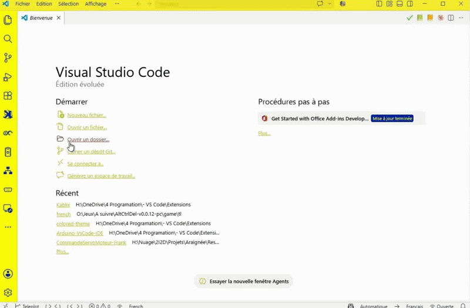

 

# Kablix
Une application **Gauloise** de simulation de microcontrôleurs (**Arduino Uno/Raspberry Pi Pico**) directement dans VS Code,
- **100 % Offline**
- **100 % Gratuit**
- **100 % Libre**
- **100 % Sans télémétrie**

La simulation s’appuie sur deux moteurs open-sources embarqués dans l’extension :
[avr8js](https://github.com/wokwi/avr8js) (ATmega328P) et
[rp2040js](https://github.com/wokwi/rp2040js) (RP2040), tous deux sous licence MIT.

## Utilisation

1. Pour démarrer, cliquer sur l’icône  dans la barre d’activité à gauche ;
    - Ou dans un dossier de projet, double cliquer sur un fichier projix ;
    - Ou si vous avez fait l’association, dans l’explorateur Windows double cliquer sur un fichier projix.

1. **Construire son montage** : Glisser/poser un composant à partir de la bibliothèque à gauche. Relier les broches en direct et clique sur le bouton autoroutage (route les composants sélectionnés ou tout le montage si aucun n’est sélectionné).

1. **Exécuter son code** : Associer un fichier de code (attention les codes ino doivent être dans un dossier de même nom) puis **▶ « démarrer»** :
   - `.ino`/`.c`/`.cpp` → compilation via la toolchain locale ;
   - `.py` → MicroPython sur le Pico simulé (firmware `.uf2` requis, voir ci-dessous) ;
   - `.hex` / `.uf2`/`.elf` / `.bin` → chargé directement sans compilation.
   
1. **Enregistrer son montage** : « Kablix : Enregistrer le projet (.projix) » ;
   un `.projix` se rouvre ensuite d’un double-clic dans l’explorateur.
   Import/export au format Wokwi (`diagram.json`) également disponibles.

## Fonctionnalités

- ✅ **Atelier visuel** : routage automatique. 
- ✅ **Créateur de composants**.
- ✅ **Export SVG**.
- ✅ **Bibliothèque de composant** : afficheur 7 segments, barre de 10 LED, interrupteur à glissière, DIP switch, joystick, potentiomètre, photorésistance (LDR), détecteur de mouvement PIR, capteur d’inclinaison, servomoteur, LED, LED RGB, bouton poussoir, résistance, buzzer et potentiomètre.
- ✅ **Cartes de développements prises en charge** : Arduino Uno, Nano, Pro Mini, Mega 2560 et Raspberry Pi Pico/Pico W, enfichables sur platine d’essai.
- ✅ **Flash RP2040 réel**.
- ✅ **Chargement direct d’artefacts** : `.hex`, `.uf2`, `.elf`, `.bin` compilés ailleurs, chargés sans recompilation
- ✅ **Compilation du code réel C/C++**
- ✅ **Moniteur série bidirectionnel** : sortie temps réel + champ d’envoi vers le microcontrôleur.
- ✅ **Traceur de courbes** : tracé en direct, plus des **sondes** posées sur une broche pour visualiser sa tension
- ✅ **Simulation physique** : luminosité selon la résistance série, les LED sans résistance grillent, les servomoteurs ne démarrent pas, l’alimentation tient compte du courant…
- ✅ **Capteurs interactifs** : curseurs et boutons pour flamme, gaz, son, lumière, température et mouvement, pilotant l’entrée du montage en direct.
- ✅ **Intégrable à Windows**.

> 📖 **Guide complet** : [docs/fr/UTILISATION.md](docs/fr/UTILISATION.md) (français)/
> [docs/en/USAGE.md](docs/en/USAGE.md) (English) — interface, câblage, création
> de composants personnalisés (avec prompt IA), format `.kablix-part.json`,
> sources de composants existants.
>
> 🌍 **Interface bilingue** : français si VS Code est en français, anglais sinon.
> Le mécanisme est extensible à d’autres langues — voir [Internationalisation](#internationalisation).
## Internationalisation

L’interface suit la langue de VS Code (`vscode.env.language`) : **français si elle commence par `fr`, anglais sinon** (langue de repli). La traduction repose sur deux registres indépendants, parce qu’ils traduisent des choses de nature différente :

| Quoi | Fichier | Forme |
| --- | --- | --- |
| Chaînes de la webview (barre d’outils, palette, inspecteur, catalogue…) | `src/webview/i18n.mts` | dictionnaire **clé (anglais) → traduction** (`DICTS`) ; `t()` retombe sur la clé anglaise si absente |
| Page d’aide (`kablix.openHelp`) | `src/help.ts` | registre de **documents HTML complets** par langue (`HELP_LOCALES`) ; repli sur l’anglais |

Les deux utilisent la même résolution : le **code base** de la langue (`fr-FR` → `fr`)
sélectionne l’entrée correspondante, et l’anglais sert de repli quand elle est absente.

### Ajouter une langue (ex. allemand, `de`)

À faire aux **deux** registres — une langue déclarée à un seul endroit ne sera traduite
qu’à moitié :

1. **Webview** — dans [`src/webview/i18n.mts`](src/webview/i18n.mts) : créer le
   dictionnaire `const DE = { … }` (mêmes clés anglaises que `FR`) puis l’ajouter à
   `DICTS` → `{ fr : FR, de : DE }`. Les clés non traduites retombent automatiquement
   sur l’anglais.
2. **Aide** — dans [`src/help.ts`](src/help.ts) : écrire `bodyDe()` (copie traduite de
   `bodyFr`/`bodyEn`), ajouter l’URL de doc `DOC_URL_DE`, puis une entrée à
   `HELP_LOCALES` → `de : { lang : 'de', title: 'Kablix — Hilfe', docUrl : DOC_URL_DE, body: bodyDe }`.

Aucune autre modification de logique n’est nécessaire : la sélection et le repli sont
gérés par `initLocale()` (webview) et `resolveLocale()` (aide).

## Crédits

Kablix est développé par **[Frank SAURET](https://electropol.fr)** et s’appuie sur les bibliothèques open sources suivantes :

| Bibliothèque | Rôle | Licence |
| --- | --- | --- |
| [avr8js](https://github.com/wokwi/avr8js) | Moteur de simulation ATmega328P (Arduino Uno) | MIT |
| [rp2040js](https://github.com/wokwi/rp2040js) | Moteur de simulation RP2040 (Raspberry Pi Pico) | MIT |
| [@wokwi/elements](https://github.com/wokwi/wokwi-elements) | Composants visuels (cartes, LED, capteurs…) | MIT |
| [JSZip](https://stuk.github.io/jszip/) | Lecture/écriture des archives `.projix` | MIT/GPLv3 |
| Bootrom B1 du RP2040 | Démarrage du RP2040 simulé | © Raspberry Pi (Trading) Ltd — BSD-3-Clause |
| MicroPython | Firmware `.uf2` exécuté sur le Pico simulé (fourni par l’utilisateur) | MIT |
| Police [LED Board-7](http://www.styleseven.com) © Sizenko Alexander (Style-7) | Texte façon afficheur LED des écrans LCD simulés | Freeware (usage libre, crédit requis) |

Le format de projet et les composants importés sont compatibles avec [Wokwi](https://wokwi.com) (format ouvert `diagram.json`).

## Licence

MIT — le bootrom RP2040 embarqué est © Raspberry Pi (Trading) Ltd, licence BSD-3-Clause.
