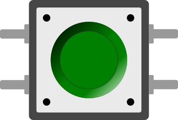

# Bouton poussoir

Bouton tactile 12 mm momentané. Au repos le circuit est ouvert ; appuyé, il relie ses deux contacts.

## Broches

| Broche | Rôle |
|--------|------|
| **1.l / 1.r** | Premier contact (gauche/droite, toujours reliés) |
| **2.l / 2.r** | Second contact (gauche/droite) |

## Propriétés

| Propriété | Rôle | Défaut |
|-----------|------|--------|
| `color` | Couleur | green |
| `label` | Texte sous le bouton | — |
| `key` | Raccourci clavier | — |

## Utilisation

- Montage : un contact vers une broche en **`INPUT_PULLUP`**, l'autre à la masse → lecture `LOW` à l'appui.
- **Ctrl+clic** : maintient le bouton enfoncé.
- Prévoir un **anti-rebond**.

---

*Fiche adaptée et traduite de la [documentation Wokwi](https://docs.wokwi.com/parts/wokwi-pushbutton) — © Wokwi. Composants `@wokwi/elements` (licence MIT).*
