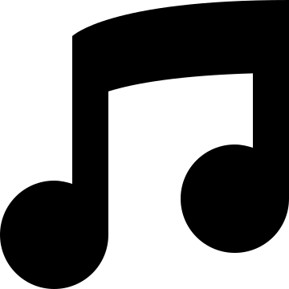

# Buzzer

Buzzer piézo actif : émet un son tant qu'une tension est appliquée entre ses bornes.

## Broches

| Broche | Rôle |
|--------|------|
| **1** | Borne + (positive) |
| **2** | Borne – |

## Utilisation

- Borne + sur une broche de sortie, borne – à la masse.
- `tone()` (Arduino) pour générer des fréquences.

---

*Fiche adaptée et traduite de la [documentation Wokwi](https://docs.wokwi.com/parts/wokwi-buzzer) — © Wokwi. Composants `@wokwi/elements` (licence MIT).*
