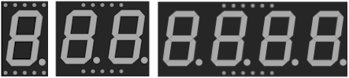

# 7-segment display

Seven-segment display (+ decimal point) for digits and simple symbols. 1 to 4 digits, common cathode or common anode.

## Pins

| Pin | Role |
|--------|------|
| **A–G** | The 7 segments |
| **DP** | Decimal point |
| **COM / COM.1 / COM.2** | Common (cathode or anode) |
| **DIG1–DIG4** | Per-digit commons (multi-digit) |

## Properties

| Property | Role | Default |
|-----------|------|--------|
| `color` | Color | red |
| `common` | Common (cathode/anode) | cathode |
| `digits` | Number of digits (1/2/4) | 1 |
| `colon` | Clock colon | — |

## Usage

- One resistor per segment.
- Common cathode: COM to ground, segments to +; common anode: the opposite.
- Multi-digit: multiplexing (light one digit at a time, quickly).

---

*Sheet adapted and translated from the [Wokwi documentation](https://docs.wokwi.com/parts/wokwi-7segment) — © Wokwi. `@wokwi/elements` components (MIT license).*
