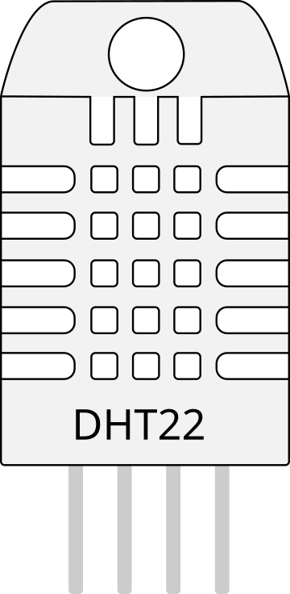

# DHT22 temperature/humidity sensor

1-wire digital temperature and humidity sensor.

## Pins

| Pin | Role |
|--------|------|
| **VCC** | Power (+) |
| **SDA** | Data (1-wire) |
| **NC** | Not connected |
| **GND** | Ground |

## Properties

| Property | Role | Default |
|-----------|------|--------|
| `temperature` | Temperature (°C) | 22 |
| `humidity` | Humidity (%) | 50 |

## Usage

- SDA to a digital pin (10 kΩ pull-up).
- DHT library: one reading every ~2 s.

---

*Sheet adapted and translated from the [Wokwi documentation](https://docs.wokwi.com/parts/wokwi-dht22) — © Wokwi. `@wokwi/elements` components (MIT license).*
