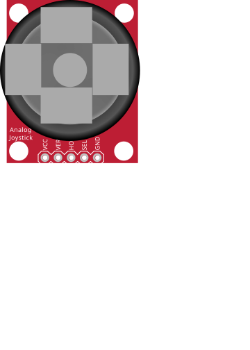

# Analog joystick

2-axis (X/Y) stick with built-in push button.

## Pins

| Pin | Role |
|--------|------|
| **VCC** | Power (+) |
| **VERT** | Vertical axis (analog) |
| **HORZ** | Horizontal axis (analog) |
| **SEL** | Button (press) |
| **GND** | Ground |

## Usage

- VERT and HORZ to two analog inputs, SEL in `INPUT_PULLUP`.
- At rest the axes read ~512 (center).

---

*Sheet adapted and translated from the [Wokwi documentation](https://docs.wokwi.com/parts/wokwi-analog-joystick) — © Wokwi. `@wokwi/elements` components (MIT license).*
