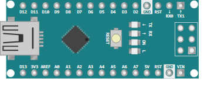

# Arduino Nano

Compact ATmega328P board (same core as the Uno), breadboard form factor.

## Pins

| Pin | Role |
|--------|------|
| **0–13** | Digital I/O (~ = PWM) |
| **A0–A7** | Analog inputs |
| **5V / 3.3V / VIN** | Power |
| **GND** | Grounds |

## Usage

- Same capabilities as the Uno, smaller.
- A6/A7: analog inputs only.

---

*Sheet adapted and translated from the [Wokwi documentation](https://docs.wokwi.com/parts/wokwi-arduino-nano) — © Wokwi. `@wokwi/elements` components (MIT license).*
