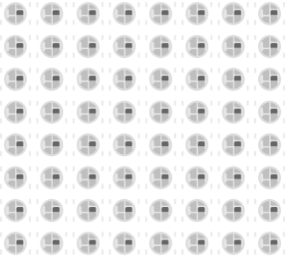

# NeoPixel matrix

Matrix of addressable RGB LEDs (WS2812), driven by a single data pin.

## Pins

| Pin | Role |
|--------|------|
| **VCC** | Power (+) |
| **GND** | Ground |
| **DIN** | Data in |
| **DOUT** | Data out |

## Properties

| Property | Role | Default |
|-----------|------|--------|
| `rows` | Number of rows | 8 |
| `cols` | Number of columns | 8 |

## Usage

- DIN to a digital pin.
- Pixel indexing in a serpentine pattern depending on the wiring.

---

*Sheet adapted and translated from the [Wokwi documentation](https://docs.wokwi.com/parts/wokwi-neopixel-matrix) — © Wokwi. `@wokwi/elements` components (MIT license).*
