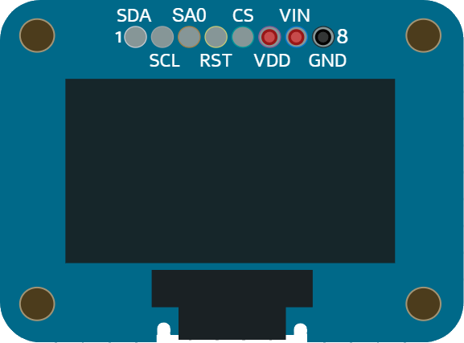

# OLED display (SSD1306)

Small 128×64 monochrome OLED display (SPI). Ideal for text and graphics.

## Pins

| Pin | Role |
|--------|------|
| **VIN** | Power (+) |
| **GND** | Ground |
| **CLK** | SPI clock (SCK) |
| **DATA** | SPI data (MOSI) |
| **DC** | Data/Command |
| **CS** | Chip select |
| **RST** | Reset |

## Usage

- SPI bus + DC + CS. Adafruit_SSD1306 / U8g2 libraries.
- Display memory address decoded and drawn in simulation.

---

*Sheet adapted and translated from the [Wokwi documentation](https://docs.wokwi.com/parts/wokwi-ssd1306) — © Wokwi. `@wokwi/elements` components (MIT license).*
