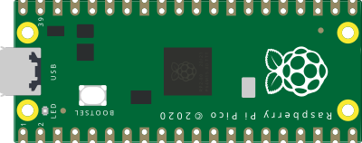

# Raspberry Pi Pico

RP2040 microcontroller board (dual-core ARM Cortex-M0+). 26 GPIO pins, 3
analog inputs (ADC), **3.3 V** logic level.

## Pins

| Pin | Role |
|--------|------|
| **GP0–GP28** | Digital I/O (GP26–GP28 = ADC0–ADC2) |
| **3V3** | 3.3 V output |
| **VSYS / VBUS** | Input power |
| **GND** | Grounds |
| **RUN** | Reset (active low) |

## Usage

- Full pinout via the **K** button (pinout poster).
- **3.3 V logic level**: do not apply 5 V to an input.
- Programmable in MicroPython or C/C++ (Arduino).

> ⚠️ The GPIOs are **not** 5 V tolerant.

---

*Kablix in-house component (board drawing). RP2040 © Raspberry Pi Ltd.*
