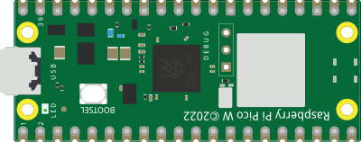

# Raspberry Pi Pico W

Identical to the Pico (RP2040, 3.3 V, same pins) with a built-in **Wi-Fi/Bluetooth**
module. The physical pinout is the same as the Pico.

## Pins

| Pin | Role |
|--------|------|
| **GP0–GP28** | Digital I/O (GP26–GP28 = ADC0–ADC2) |
| **3V3** | 3.3 V output |
| **VSYS / VBUS** | Input power |
| **GND** | Grounds |
| **RUN** | Reset (active low) |

## Usage

- Full pinout via the **K** button.
- **3.3 V** logic level (not 5 V tolerant).
- Wi-Fi is **not emulated** by the core; Kablix offers an optional network bridge via the host (setting `kablix.picowNetworkBridge`).

---

*Kablix in-house component (board drawing). RP2040 © Raspberry Pi Ltd.*
