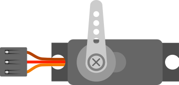

# Servo motor

Positional servo motor driven by a PWM signal (angle 0–180°).

## Pins

| Pin | Role |
|--------|------|
| **PWM** | Control signal |
| **V+** | Power (+) |
| **GND** | Ground |

## Properties

| Property | Role | Default |
|-----------|------|--------|
| `horn` | Horn type (single/double/cross) | single |

## Usage

- PWM to a pin, V+ to +5 V, GND to ground.
- `Servo` library: `attach()` then `write(angle)`.

---

*Sheet adapted and translated from the [Wokwi documentation](https://docs.wokwi.com/parts/wokwi-servo) — © Wokwi. `@wokwi/elements` components (MIT license).*
