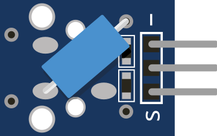

# Tilt sensor

Ball switch: closes/opens depending on tilt.

## Pins

| Pin | Role |
|--------|------|
| **VCC** | Power (+) |
| **OUT** | Digital output |
| **GND** | Ground |

## Properties

| Property | Role | Default |
|-----------|------|--------|
| `state` | Tilted (0/1) | 0 |

## Usage

- OUT to a digital input (often `INPUT_PULLUP`).
- Toggle the state in the inspector.

---

*Sheet adapted and translated from the [Wokwi documentation](https://docs.wokwi.com/parts/wokwi-tilt-switch) — © Wokwi. `@wokwi/elements` components (MIT license).*
