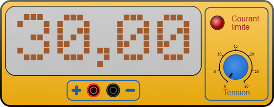

# Alimentation de laboratoire

Source de tension continue **réglable de 0 à 30 V**, avec limitation de courant.
Elle alimente un montage **sans microcontrôleur** (une LED s'allume sur l'alim
seule) ou fournit la puissance que la carte ne peut pas donner : servomoteurs,
bornier *Power In* du [pilote PWM PCA9685](pca9685.md), bandeaux de LED…

Catégorie de la palette : **Appareils de mesure**.

## Broches

| Borne | Rôle |
|-------|------|
| **V+** | Prise banane **rouge** — pôle positif (rail haut du montage) |
| **GND** | Prise banane **noire** — masse (0 V, commune à tout le montage) |

Les deux prises sont espacées de 20 px (deux pas de grille). Les fils câblés sur
V+ et GND prennent automatiquement les couleurs rouge et noire.

## Propriétés

| Propriété | Rôle | Défaut |
|-----------|------|--------|
| `voltage` | **Tension de démarrage** (V), 0 à 30 par pas de 0,1 | `5` |
| `maxcurrent` | Courant maximal fourni (A), 0,1 à 10 par pas de 0,1 | `1` |

> `voltage` est la valeur au **lancement** de la simulation : le bouton la fait
> ensuite varier librement, et la tension repart de cette valeur à chaque
> nouveau lancement.

## Régler la tension en cours de simulation

Le bouton du panneau se tourne **à la souris**, comme sur un vrai appareil :
appuyez dessus et faites tourner autour de son centre.

- Course de **300°** dans le sens horaire pour aller de **0 V à 30 V**
  (soit 10° par volt) ; les 60° restants sont une **zone morte** — en y entrant,
  le bouton reste collé à l'extrémité la plus proche (0 V ou 30 V).
- L'afficheur donne la tension courante au centième (`0,00` à `30,00`).
- Le bouton est **inerte en édition** : il ne tourne qu'une fois la simulation
  lancée. Le zoom et la rotation du composant sont pris en compte.

## Limitation de courant

Kablix estime en continu le courant débité par l'alimentation (approximation
pédagogique, recalculée à chaque image) :

- chemin résistif le plus direct de **V+ vers la masse** (loi d'Ohm ; un fil qui
  relie directement V+ à GND est un **court-circuit**) ;
- chaque **LED** remontant au V+ de l'alimentation : `(V − Vf) / R` ;
- **0,2 A par servomoteur** alimenté par le rail V+ ;
- la consommation déclarée par les modules alimentés (bornier du PCA9685…).

Quand ce courant dépasse `maxcurrent`, la LED **« Courant limite »** s'allume en
rouge vif avec un halo — exactement comme une vraie alimentation qui passe en
limitation. Augmentez le courant maximal, ou corrigez le montage (résistance
série manquante, court-circuit).

## Utilisation

- Câblez **V+** au rail positif du montage et **GND** à la masse — la masse doit
  être **commune** avec celle de la carte si les deux alimentent le même circuit.
- Vérifiez la tension **avant** de brancher : 30 V sur une LED + 220 Ω la grille,
  2,5 V sur une LED bleue ne l'allument pas.
- Pour des servomoteurs ou un PCA9685 : **~5 V** et un courant maximal couvrant
  la charge (0,2 A par servo). En dessous, les sorties ne bougent pas.

---

*Dessin de l'appareil réalisé par Frank pour Kablix.*
