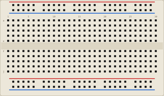

# Platine d'essai (breadboard)

Plaque de prototypage sans soudure. Les trous sont reliés par bandes pour connecter
les composants en enfichant simplement leurs pattes.

## Connexions internes

- **Rails d'alimentation** (lignes du haut et du bas, **+** rouge et **–** bleu) : tous les trous d'un rail sont reliés sur toute la longueur.
- **Colonnes centrales** : les 5 trous d'une même colonne (a–e, puis f–j) sont reliés entre eux.
- Le **sillon central** sépare les deux moitiés (a–e et f–j) : pratique pour les circuits intégrés.

## Propriétés

| Propriété | Rôle | Défaut |
|-----------|------|--------|
| `size` | Taille (mini / moyenne / grande) | moyenne |

## Utilisation

- Placer l'alimentation sur les rails + / –, les composants sur les colonnes.
- Les pattes des composants s'**enfichent** automatiquement sur la grille de 10 px.

---

*Composant maison Kablix.*
