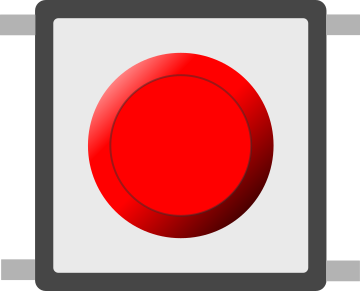

# Bouton poussoir (6 mm)

Petit bouton tactile 6 mm, même fonctionnement que le bouton 12 mm.

## Broches

| Broche | Rôle |
|--------|------|
| **1.l / 1.r** | Premier contact |
| **2.l / 2.r** | Second contact |

## Propriétés

| Propriété | Rôle | Défaut |
|-----------|------|--------|
| `color` | Couleur | red |
| `key` | Raccourci clavier | — |

## Utilisation

- Identique au bouton 12 mm : `INPUT_PULLUP` + masse.
- Anti-rebond conseillé.

---

*Fiche adaptée et traduite de la [documentation Wokwi](https://docs.wokwi.com/parts/wokwi-pushbutton-6mm) — © Wokwi. Composants `@wokwi/elements` (licence MIT).*
