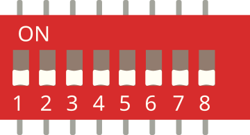

# Interrupteur DIP ×8

Bloc de 8 micro-interrupteurs indépendants (configuration / adresses).

## Broches

| Broche | Rôle |
|--------|------|
| **1a–8a** | Côté A de chaque interrupteur |
| **1b–8b** | Côté B correspondant |

## Utilisation

- Chaque interrupteur relie son côté a à son côté b quand il est fermé.
- Souvent : un côté à la masse, l'autre en `INPUT_PULLUP`.

---

*Fiche adaptée et traduite de la [documentation Wokwi](https://docs.wokwi.com/parts/wokwi-dip-switch-8) — © Wokwi. Composants `@wokwi/elements` (licence MIT).*
