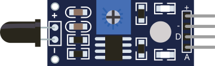

# Capteur de flamme

Détecteur de flamme (infrarouge). Sorties analogique et numérique.

## Broches

| Broche | Rôle |
|--------|------|
| **VCC** | Alimentation (+) |
| **GND** | Masse |
| **DOUT** | Sortie numérique (1 = flamme) |
| **AOUT** | Sortie analogique |

## Propriétés

| Propriété | Rôle | Défaut |
|-----------|------|--------|
| `state` | Flamme détectée (0/1) | 0 |

## Utilisation

- DOUT vers une entrée numérique.
- Basculer l'état dans l'inspecteur.

---

*Fiche adaptée et traduite de la [documentation Wokwi](https://docs.wokwi.com/parts/wokwi-flame-sensor) — © Wokwi. Composants `@wokwi/elements` (licence MIT).*
