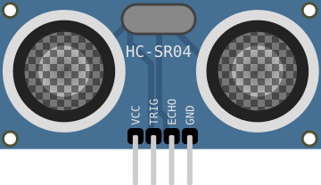

# Capteur ultrason HC-SR04

Télémètre à ultrasons : mesure une distance (2–400 cm) par temps de vol.

## Broches

| Broche | Rôle |
|--------|------|
| **VCC** | Alimentation (+5 V) |
| **TRIG** | Déclenchement (impulsion) |
| **ECHO** | Écho (durée ∝ distance) |
| **GND** | Masse |

## Propriétés

| Propriété | Rôle | Défaut |
|-----------|------|--------|
| `distance` | Distance simulée (cm) | 20 |

## Utilisation

- Impulsion 10 µs sur TRIG, mesurer la largeur de ECHO (`pulseIn`).
- distance_cm = durée_µs / 58.

---

*Fiche adaptée et traduite de la [documentation Wokwi](https://docs.wokwi.com/parts/wokwi-hc-sr04) — © Wokwi. Composants `@wokwi/elements` (licence MIT).*
