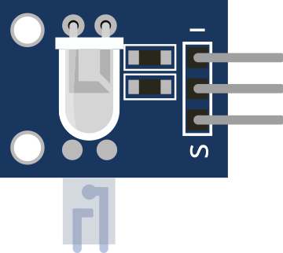

# Capteur de pouls

Capteur optique de fréquence cardiaque. Sortie analogique (pulsation).

## Broches

| Broche | Rôle |
|--------|------|
| **VCC** | Alimentation (+) |
| **OUT** | Sortie analogique |
| **GND** | Masse |

## Propriétés

| Propriété | Rôle | Défaut |
|-----------|------|--------|
| `value` | Pulsation simulée (%) | 50 |

## Utilisation

- OUT vers une entrée analogique.
- Filtrer le signal pour extraire les battements.

---

*Fiche adaptée et traduite de la [documentation Wokwi](https://docs.wokwi.com/parts/wokwi-heart-beat-sensor) — © Wokwi. Composants `@wokwi/elements` (licence MIT).*
