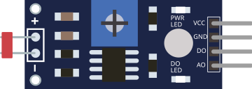

# Photorésistance (LDR)

Capteur de lumière : sa résistance varie avec l'éclairement. Sortie analogique et numérique.

## Broches

| Broche | Rôle |
|--------|------|
| **VCC** | Alimentation (+) |
| **GND** | Masse |
| **AO** | Sortie analogique (luminosité) |
| **DO** | Sortie numérique (seuil) |

## Propriétés

| Propriété | Rôle | Défaut |
|-----------|------|--------|
| `value` | Luminosité simulée (%) | 50 |

## Utilisation

- AO vers une entrée analogique, lecture `analogRead()`.
- DO bascule selon un seuil réglable (sur la vraie carte).

---

*Fiche adaptée et traduite de la [documentation Wokwi](https://docs.wokwi.com/parts/wokwi-photoresistor-sensor) — © Wokwi. Composants `@wokwi/elements` (licence MIT).*
