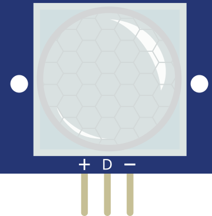

# Capteur de mouvement PIR

Détecteur de mouvement infrarouge passif. Sortie numérique haute en cas de détection.

## Broches

| Broche | Rôle |
|--------|------|
| **VCC** | Alimentation (+) |
| **OUT** | Sortie numérique (1 = mouvement) |
| **GND** | Masse |

## Propriétés

| Propriété | Rôle | Défaut |
|-----------|------|--------|
| `state` | Mouvement détecté (0/1) | 0 |

## Utilisation

- OUT vers une entrée numérique.
- Régler « mouvement détecté » dans l'inspecteur pour simuler.

---

*Fiche adaptée et traduite de la [documentation Wokwi](https://docs.wokwi.com/parts/wokwi-pir-motion-sensor) — © Wokwi. Composants `@wokwi/elements` (licence MIT).*
