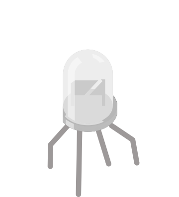

# LED RGB

LED tricolore (rouge/vert/bleu) à cathode (ou anode) commune. Mélange des trois canaux pour obtenir n'importe quelle couleur.

## Broches

| Broche | Rôle |
|--------|------|
| **R** | Rouge |
| **G** | Vert |
| **B** | Bleu |
| **COM** | Commun (cathode ou anode) |

## Propriétés

| Propriété | Rôle | Défaut |
|-----------|------|--------|
| `common` | Broche commune (cathode/anode) | cathode |

## Utilisation

- Une résistance par canal R/G/B.
- Cathode commune : COM à la masse, canaux au +. Anode commune : l'inverse.
- PWM sur R/G/B pour doser chaque couleur.

---

*Fiche adaptée et traduite de la [documentation Wokwi](https://docs.wokwi.com/parts/wokwi-rgb-led) — © Wokwi. Composants `@wokwi/elements` (licence MIT).*
