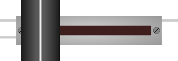

# Potentiomètre à glissière

Potentiomètre linéaire à curseur coulissant. Même principe que le rotatif.

## Broches

| Broche | Rôle |
|--------|------|
| **VCC** | Alimentation (+) |
| **SIG** | Curseur → entrée analogique |
| **GND** | Masse |

## Propriétés

| Propriété | Rôle | Défaut |
|-----------|------|--------|
| `value` | Position initiale (0–100 %) | 50 |

## Utilisation

- SIG vers une entrée analogique, lecture `analogRead()`.
- Régler en simulation : **glisser** le curseur.

---

*Fiche adaptée et traduite de la [documentation Wokwi](https://docs.wokwi.com/parts/wokwi-slide-potentiometer) — © Wokwi. Composants `@wokwi/elements` (licence MIT).*
