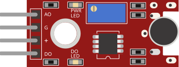

# Capteur de son

Microphone avec comparateur. Sorties analogique (niveau) et numérique (seuil).

## Broches

| Broche | Rôle |
|--------|------|
| **VCC** | Alimentation (+) |
| **GND** | Masse |
| **AOUT** | Sortie analogique |
| **DOUT** | Sortie numérique (seuil) |

## Propriétés

| Propriété | Rôle | Défaut |
|-----------|------|--------|
| `state` | Son détecté (0/1) | 0 |

## Utilisation

- DOUT vers une entrée numérique, AOUT vers une analogique.
- Régler le seuil sur le vrai module.

---

*Fiche adaptée et traduite de la [documentation Wokwi](https://docs.wokwi.com/parts/wokwi-small-sound-sensor) — © Wokwi. Composants `@wokwi/elements` (licence MIT).*
