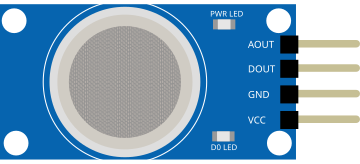

# Capteur de gaz (MQ)

Capteur de gaz/fumée série MQ. Sorties analogique (concentration) et numérique (seuil).

## Broches

| Broche | Rôle |
|--------|------|
| **VCC** | Alimentation (+) |
| **GND** | Masse |
| **AOUT** | Sortie analogique |
| **DOUT** | Sortie numérique (seuil) |

## Propriétés

| Propriété | Rôle | Défaut |
|-----------|------|--------|
| `value` | Niveau de gaz simulé (%) | 20 |

## Utilisation

- AOUT vers une entrée analogique.
- Préchauffage nécessaire sur le vrai capteur.

---

*Fiche adaptée et traduite de la [documentation Wokwi](https://docs.wokwi.com/parts/wokwi-gas-sensor) — © Wokwi. Composants `@wokwi/elements` (licence MIT).*
