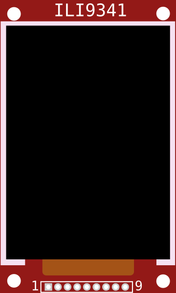

# Écran TFT (ILI9341)

Écran TFT couleur 240×320 (SPI). Affiche textes, images et graphiques.

## Broches

| Broche | Rôle |
|--------|------|
| **VCC / GND** | Alimentation |
| **SCK / MOSI / MISO** | Bus SPI |
| **CS** | Sélection puce |
| **D/C** | Data/Command |
| **RST** | Reset |
| **LED** | Rétroéclairage |

## Utilisation

- Bus SPI. Bibliothèques Adafruit_ILI9341 / TFT_eSPI.
- Le canvas est décodé et dessiné en simulation.

---

*Fiche adaptée et traduite de la [documentation Wokwi](https://docs.wokwi.com/parts/wokwi-ili9341) — © Wokwi. Composants `@wokwi/elements` (licence MIT).*
