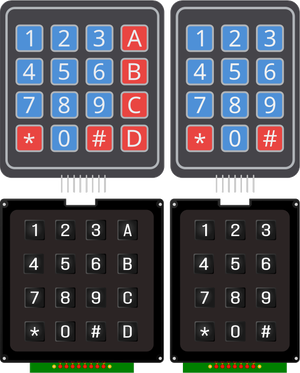

# Clavier matriciel

Clavier à membrane ou à touche 4×3 ou 4×4 : matrice de touches lignes × colonnes.

## Broches

| Broche | Rôle |
|--------|------|
| **L1–L4** | Lignes |
| **C1–C4** | Colonnes |

## Propriétés

| Propriété | Rôle | Défaut |
|-----------|------|--------|
| `Colonnes` | Nombre de colonnes (3/4) | 4 |

## Utilisation

- Scanner la matrice : activer une ligne, lire les colonnes.
---

*Fiche adaptée et traduite de la [documentation Wokwi](https://docs.wokwi.com/parts/wokwi-membrane-keypad) — © Wokwi. Composants `@wokwi/elements` (licence MIT).*
