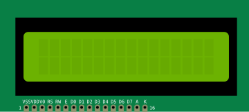

# LCD Texte

Afficheur LCD à caractères (HD44780). 16×2 ou 20×4, en I²C (4 fils) ou parallèle.

## Broches

| Broche | Rôle |
|--------|------|
| **GND / VCC** | Alimentation (mode I²C) |
| **SDA / SCL** | Bus I²C (mode I²C) |
| **RS, RW, E, D0–D7** | Bus parallèle (mode parallèle) |
| **V0** | Contraste |
| **A / K** | Rétroéclairage |

## Propriétés

| Propriété | Rôle | Défaut |
|-----------|------|--------|
| `pins` | Interface (I²C / parallèle) | i2c |
| `lcdSize` | Taille (16×2 / 20×4) | 16x2 |

## Utilisation

- I²C : seulement 4 fils (GND, VCC, SDA, SCL) + adresse (0x27 souvent).
- Le texte n'est simulé qu'en **I²C** ; en parallèle l'afficheur est visuel.

---

*Fiche adaptée et traduite de la [documentation Wokwi](https://docs.wokwi.com/parts/wokwi-lcd1602) — © Wokwi. Composants `@wokwi/elements` (licence MIT).*
