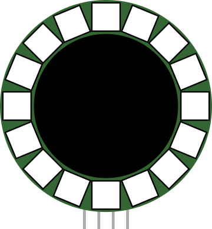

# Anneau NeoPixel

Anneau de LED RGB adressables (WS2812).

## Broches

| Broche | Rôle |
|--------|------|
| **VCC** | Alimentation (+) |
| **GND** | Masse |
| **DIN** | Données entrantes |
| **DOUT** | Données sortantes |

## Propriétés

| Propriété | Rôle | Défaut |
|-----------|------|--------|
| `pixels` | Nombre de LED | 16 |

## Utilisation

- DIN vers une broche numérique.
- Effets circulaires (rotation, jauge).

---

*Fiche adaptée et traduite de la [documentation Wokwi](https://docs.wokwi.com/parts/wokwi-led-ring) — © Wokwi. Composants `@wokwi/elements` (licence MIT).*
