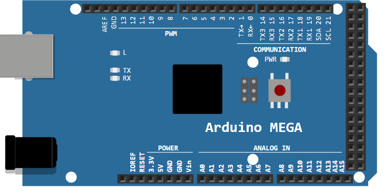

# Arduino Mega 2560

Carte ATmega2560 : 54 E/S numériques (15 PWM), 16 entrées analogiques, 4 UART.

## Broches

| Broche | Rôle |
|--------|------|
| **0–53** | E/S numériques |
| **A0–A15** | Entrées analogiques |
| **5V / 3.3V / VIN** | Alimentations |
| **GND** | Masses |

## Utilisation

- Pour les projets gourmands en broches.
- Brochage complet via le bouton **K**.

---

*Fiche adaptée et traduite de la [documentation Wokwi](https://docs.wokwi.com/parts/wokwi-arduino-mega) — © Wokwi. Composants `@wokwi/elements` (licence MIT).*
