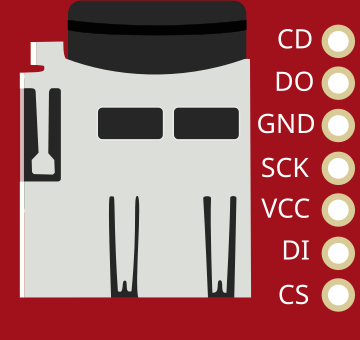

# Carte microSD (SPI)

Lecteur de carte microSD en SPI : stockage de fichiers.

## Broches

| Broche | Rôle |
|--------|------|
| **VCC / GND** | Alimentation |
| **SCK** | Horloge SPI |
| **DI** | Données entrantes (MOSI) |
| **DO** | Données sortantes (MISO) |
| **CS** | Sélection puce |
| **CD** | Détection de carte |

## Utilisation

- Bus SPI + CS. Bibliothèque `SD`.
- Init, lecture/écriture de blocs simulées.

---

*Fiche adaptée et traduite de la [documentation Wokwi](https://docs.wokwi.com/parts/wokwi-microsd-card) — © Wokwi. Composants `@wokwi/elements` (licence MIT).*
