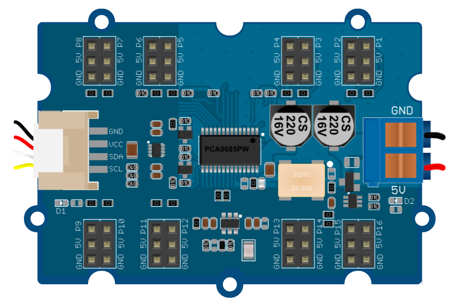

# Pilote PWM 16 canaux (PCA9685)



Module Grove **16-Channel PWM Driver** de Seeed (réf. 108020102), basé sur le
NXP **PCA9685** : 16 sorties PWM 12 bits sur bus I²C, pensées pour piloter des
servomoteurs ou des LED. 16 connecteurs servo **P1 à P16** (canaux 0 à 15).

## Broches

| Broche | Rôle |
|--------|------|
| **SDA / SCL** | Bus I²C (connecteur Grove, à gauche) |
| **VCC / GND** | Alimentation logique de la puce (connecteur Grove) |
| **V+ / GND.2** | Bornier d'alimentation des servos (**Power In**, à droite) |
| **PWM0…PWM15** | Signal de chaque connecteur servo (P1 = PWM0 … P16 = PWM15) |
| **Pn.5V / Pn.GND** | Alimentation de chaque connecteur servo (rouge/noir) |

## Propriétés

| Propriété | Rôle | Défaut |
|-----------|------|--------|
| `ad0` … `ad5` | État des six pads d'adresse de la carte (coché = pad **haut**) | tous cochés |

## Adresse I²C


L'adresse ne se choisit pas dans une liste : elle se règle **comme sur la vraie
carte**, en cochant les six pads **AD0 à AD5** de l'inspecteur (visibles au dos
du module, ci-dessus). L'adresse 7 bits qui en résulte s'affiche sous les cases
et vaut :

```
adresse = 1 A5 A4 A3 A2 A1 A0
```

Le bit 6 est **câblé haut** sur le module et le bit 7 n'existe pas : l'adresse va
donc de **0x40** (tous les pads bas) à **0x7F** (tous hauts).

| AD5 | AD4 | AD3 | AD2 | AD1 | AD0 | Adresse |
|:---:|:---:|:---:|:---:|:---:|:---:|---------|
| 0 | 0 | 0 | 0 | 0 | 0 | `0x40` |
| 0 | 0 | 0 | 0 | 0 | 1 | `0x41` |
| 0 | 0 | 0 | 0 | 1 | 0 | `0x42` |
| … | … | … | … | … | … | … |
| 1 | 1 | 1 | 1 | 1 | 1 | `0x7F` |

> La carte Grove sort d'usine avec **tous ses pads hauts → 0x7F** (contrairement
> au module PCA9685 nu d'Adafruit, dont les pads sont bas → 0x40 : décochez les
> six cases pour le simuler). C'est cette adresse que votre programme doit
> utiliser. Sur plusieurs cartes du même bus, donnez à chacune une combinaison
> de pads différente.

## Alimentation externe obligatoire

Les servomoteurs ne sont **pas** alimentés par la logique de la carte : il faut
brancher une **[alimentation de laboratoire](alim.md)** (catégorie *Appareils de
mesure*) réglée sur **~5 V** au **courant suffisant** sur
le bornier **V+ / GND.2** (Power In).

- Sans cette alimentation (ou hors de la plage 4,5–5,5 V, ou courant insuffisant),
  les sorties **ne bougent pas** — la puce répond quand même sur I²C, exactement
  comme la vraie carte.
- Chaque servo consomme ~0,2 A : ajustez le *courant max fourni* de l'alimentation.

## Utilisation

- Câblez SDA/SCL/VCC/GND au microcontrôleur, le bornier V+/GND.2 à l'alimentation.
- Branchez un servo (PWM/V+/GND) sur un connecteur **P1…P16**.
- Le PCA9685 génère 16 signaux PWM à 50 Hz ; une impulsion de 0,5–2,5 ms donne
  un angle de 0–180°.
- Adressez les registres du PCA9685 (MODE1, PRESCALE, LED0_ON_L…) via I²C, ou
  utilisez une bibliothèque dédiée (Adafruit PCA9685, `grove_16_channels_pwm`…).

## Pour aller plus loin

- [Wiki Seeed Studio — Grove 16-Channel PWM Driver (PCA9685)](https://wiki.seeedstudio.com/Grove-16-Channel_PWM_Driver-PCA9685/)
  (documentation officielle du module : brochage, pads d'adresse, bibliothèques).

---

*Module PCA9685 (NXP) — carte Grove 16-Channel PWM Driver de Seeed. Dessin
retouché par Frank pour Kablix.*
