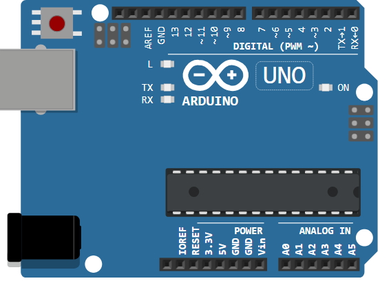

# Arduino Uno

Carte ATmega328P : 14 E/S numériques (6 PWM), 6 entrées analogiques, USB.

## Broches

| Broche | Rôle |
|--------|------|
| **0–13** | E/S numériques (~ = PWM) |
| **A0–A5** | Entrées analogiques |
| **5V / 3.3V / VIN** | Alimentations |
| **GND** | Masses |
| **AREF / RESET** | Référence ADC / reset |

## Utilisation

- Brochage complet via le bouton **K** (poster).
- Niveau logique 5 V.

---

*Fiche adaptée et traduite de la [documentation Wokwi](https://docs.wokwi.com/parts/wokwi-arduino-uno) — © Wokwi. Composants `@wokwi/elements` (licence MIT).*
