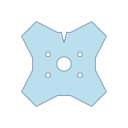
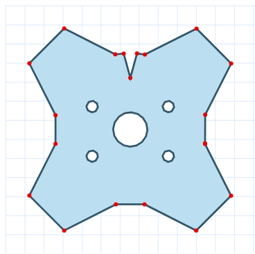
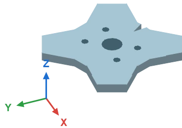
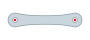
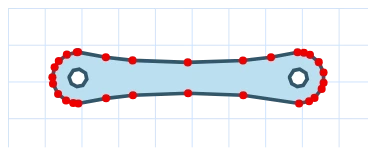
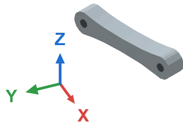
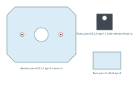
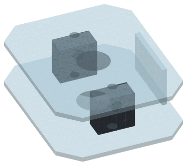
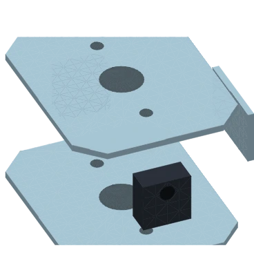

# Drawing systems in 3D (spider, legs, plates)

The spider robot and its leg are not SVG files pasted on screen: they are **volumes computed on every frame** by the isometric engine [`iso3d.mts`](../../src/webview/composants/iso3d.mts). That is what lets a leg actually lift — a flat drawing produced the same picture whether you turned the hip or bent the knee.

The price was that shapes were **hard-coded**: the chassis was `regularPoly(8, 55)`, an octagon; the bones were boxes. Not a single pencil stroke in there. This guide describes the path opened in v2026.8.23: **you draw the outline of a part, the engine turns it into a volume**. The drawing stays yours; the kinematics, the shading and the depth sorting stay with the engine.

There are **two ways** to draw, and the guide covers them in order:

| | What you draw | What comes out | For |
| --- | --- | --- | --- |
| **Profile** | **one** flat part, at any scale | the part, scaled by the component | a silhouette: the robot chassis, a leg bone, a board |
| **Assembly** | **several** flat parts, **in millimetres**, each with its pose | the complete build, dimensions kept | a sandwich body: two 3 mm sides with the servos between them |

The difference fits in one sentence: in a profile only the **proportions** matter; in an assembly **the dimensions are the information** — between two sides, 3 mm of material and 25 mm of gap are not recomputed, they are measured.

This guide is for people working on **the repository**. For a regular flat component (a diode, a sensor), the chain is different and described in [Creating a Kablix component](Creating-components.md).

In a hurry? Jump to [original drawing, and what comes out](#original-drawing-and-what-comes-out): three pictures are worth the page. Here for the sandwich body? That is [Assembling several parts](#assembling-several-parts).

---

## What you need

- The repository cloned, `npm install` done, Node 20+.
- **Inkscape** (or any SVG editor) to draw in `Composants.svg`.
- **Chrome / Chromium** installed: outlines are read through a headless browser. Flattening Bézier curves and elliptical arcs by hand in Node would mean writing wrong code twice — `getPointAtLength` does it right, and for free.

---

## The chain at a glance

**A profile** — one part, at any scale:

| # | Step | Command / file |
| --- | --- | --- |
| 1 | Draw the outline of the part | `Composants.svg`, group `<name>-profil` |
| 2 | Read it | `npm run profil <name>` → `src/webview/composants/profils.mts` |
| 3 | Look at it | `node scripts/_capture-profil.mjs <name>:plat` then `<name>:plaque` or `<name>:piece` |
| 4 | Turn it into a volume | nothing to do if the name is already expected (table below), otherwise the element |
| 5 | Check | `npm run verify:profils` |

**An assembly** — several parts, in millimetres:

| # | Step | Command / file |
| --- | --- | --- |
| 1 | Draw the parts, each with its **pose label** | `Composants.svg`, groups `<assembly>-<part>` |
| 2 | Read it and **watch it turn** | `npm run montre <assembly>` |
| 3 | Store it only (no window) | `npm run assemblage <assembly>` → `src/webview/composants/assemblages.mts` |
| 4 | Produce the doc pictures | `node scripts/_capture-profil.mjs <assembly>:assemblage` and `:eclate` |
| 5 | Check | `npm run verify:assemblage` |

Step 4 of the profile chain is empty in the common case: components **already look for** their profiles by name and fall back to the hard-coded shape as long as the drawing does not exist. Drawing `araignee-chassis` and extracting it is enough to change the robot's silhouette, without touching a line of TypeScript.

On the assembly side, `npm run montre` does steps 1 to 3 in one go: it re-reads the drawing, stores it, and opens the scene in a window where you can turn it. That is **the** working loop — redraw in Inkscape, run it again, look.

---

## What a profile is

A **profile** is the outline of a part, **flat**, like a laser-cutting plan: the silhouette, plus the holes. The engine turns it into a volume in two ways, and two only.

| Staging | The drawing is seen | The volume obtained | Function |
| --- | --- | --- | --- |
| **Plate** | from **above** | outline extruded **upwards**, by its thickness | `prismFaces` |
| **Part** | from the **side**, lying down | outline laid **between two points**, by its thickness | `extrudeProfile` |

A plate is the robot chassis, a board, a flat bracket. A part is a leg bone, a servo block, a linkage: something that goes **from one joint to the next** and follows the motion.

Holes are not actually carved into the material: they are laid as **dark decals** on the face you see (`decalFaces`). The picture is identical, and triangulating a polygon with holes — which would buy nothing here — is avoided.

---

## Orientation: where the top of the drawing goes

This is the one thing that cannot be guessed for you.

- **Plate**: drawn **seen from above**, the **top of the drawing is the front** of the robot.
- **Part**: drawn **from the side, lying horizontally**. The **left edge** lands on the first joint, the **right edge** on the second. The top of the drawing stays up.

Two consequences that save a lot of surprises:

1. **The dimensions of the drawing do not matter, its proportions do.** A plate is scaled to the chassis diameter; a part is scaled **as a block** (length *and* height by the same factor) to reach from one joint to the other. The same femur therefore serves the standalone leg and the robot's longer legs without distorting. Draw at a comfortable size, not an "exact" one.
2. **Centring is automatic**, on the middle of the bounding box. No need to align your drawing on the origin of the sheet.

Stored coordinates are in **pixels of the 10 px grid** of the canvas. If your Inkscape sheet is in millimetres — which `Composants.svg` is — the conversion happens on the way in.

---

## Drawing the profile

In `Composants.svg`, the A3 sheet where all original drawings live:

- **A profile is a group (or a plain path) whose `id` is `<name>-profil`.** The bare name is accepted as a fallback, but the suffix avoids confusing a profile with the flat drawing of a component of the same name.
- **One closed outline for the part.** Outlines **entirely contained** in it are its **holes** (mounting holes, lightening cut-outs). An outline that is neither the part nor contained in it is reported and ignored — two parts in one group is a drawing to fix, not a guess to make.
- **The outline must not cross itself.** A figure-of-eight silhouette, an edge folded back on itself: triangulating that is meaningless, and `verify:profils` rejects it.
- **Curves are welcome**: Béziers, arcs, circles, rectangles, polygons. Everything is flattened then simplified — a sampled circle ends up with about thirty points, not two hundred.
- **The winding direction does not matter** (clockwise or counter-clockwise): it is normalised on read.
- **Red pads are not part of the outline** — but a **named** pad is stored with the piece: it is a joint (`hanche`, `genou`), and two pads sharing a prefix make a **rotation axis**. See [Axes](#axes): the convention is exactly the one used by assemblies. An unnamed pad and any text stay plain sheet markers, and are ignored.

> The classic trap is the **outline that walks backwards**. On the example chassis, the front notch was first drawn wider than the shoulders framing it: the path went back on itself and folded over. The edges of a notch sit **on** the body circle, never beyond it.

The names the code already looks for — drawing them is enough, there is nothing to wire:

| Group name | Part | Staging | Fallback without a drawing |
| --- | --- | --- | --- |
| `araignee-chassis` | spider robot plate | plate | eight-sided octagon |
| `araignee-picow` | Pico W board sitting on the robot's back | plate | 46 × 18 box |
| `araignee-pca9685` | 16-servo board, on the plate | plate | 40 × 24 box |
| `araignee-batterie` | battery pack, on the plate | plate | 34 × 18 box |
| `patte-femur` | hip → knee bone | part | box |
| `patte-tibia` | knee → foot bone | part | box |

> **The on-board electronics is redrawable like everything else** (v2026.8.26). Draw each board **seen from above, connector to the left**: the outline is scaled on its **length** (46, 40 or 34 scene units), its holes are laid as decals in a darkened shade of the board, and **its place on the plate does not change** — the code holds that, so nothing overlaps. On the Pico W, the radio shield and the USB socket are still laid on top by the code.

---

## Reading it

```bash
npm run profil araignee-chassis patte-femur     # = node scripts/_extract-profils.mjs
```

Output:

```text
  ✓ araignee-chassis : 24 points, 112.4×110.8 px, 5 trou(s)
  ✓ patte-femur : 30 points, 73.83×13.98 px, 2 trou(s)

  → src/webview/composants/profils.mts (3 profil(s))
```

| Option | Effect |
| --- | --- |
| `--list` | Shows what is already stored, without reading or writing anything. |
| `--source=file.svg` | Reads a file other than `Composants.svg` (the examples in this guide come from `docs/exemples/`). |
| `--step=0.35` | Curve sampling step, in drawing units. Finer than the eye by default. |
| `--tol=0.25` | Simplification tolerance, in grid pixels. Below that, a point no longer changes the silhouette and only weighs the render down. |

The generated module, `src/webview/composants/profils.mts`, **is its own archive**: the tool reads it back before rewriting it, so extracting a single profile does not make the others disappear. It reads well in a `git diff` — it is versioned drawing — but **is not edited by hand**: the next extraction would overwrite the change.

---

## Turning it into a volume

A component asks for its profile by name and falls back to its hard-coded shape if it does not exist yet. That is the whole wiring, and it fits in three lines. For a leg bone ([`patte-element.mts`](../../src/webview/composants/patte-element.mts)):

```ts
function bone(name: string, a: Vec3, b: Vec3, t: number): Face[] {
  if (!hasProfile(name)) return boxFaces(a, b, t, t, COLORS.bone);
  const p = profile(name);
  return extrudeProfile(p, a, b, t, COLORS.bone, p.holes);
}
```

For a plate ([`araignee-element.mts`](../../src/webview/composants/araignee-element.mts)), the outline is additionally scaled to the expected diameter and rotated by the presentation yaw, **so that the drawing decides the silhouette and not the dimensions**: hips, legs, boards and terminal block stay where the rest of the component expects them.

```ts
const plate = prismFaces(outline.poly, CHASSIS.height, CHASSIS.height + CHASSIS.thickness, COLORS.chassis);
const faces = [
  ...plate,
  ...outline.holes.flatMap((h) => decalFaces(h, CHASSIS.height + CHASSIS.thickness, '#8fb3c4', plate)),
];
```

Three details of the engine that explain the rest of the code:

1. **All faces of the scene are sorted together**, far to near (painter's algorithm). Sorting each part separately would break the illusion: the shared sort is what puts a rear leg behind the plate and the front leg in front of it.
2. **Large faces are subdivided** into pieces of comparable size. A face is sorted by its **average** depth: a whole plate in one piece would pass in front of — or behind — everything it carries, and the Pico sitting on its edge used to vanish under it.
3. **A decal is sorted just in front of the face carrying it**, not merely lifted by a few tenths: the plate is made of dozens of triangles, and those on the rear edge come in front of whatever is at the centre. Nothing else gets hidden — a leg flying over the plate is still far closer to the eye than any piece of it.

---

## Original drawing, and what comes out

Two complete examples, one of each kind. The drawings are in [`docs/exemples/`](../exemples/), the profiles stored under the names `chassis-demo` and `femur-demo`, and **the pictures on the right are produced by the real engine** — never by a screenshot.

### A plate: `chassis-demo`

| The drawing | What the reader understood | What the engine makes of it |
| --- | --- | --- |
|  |  |  |
| Seen from above: four arms at ±45°, a V notch at the front, five holes. Drawn in an SVG editor, `fill-rule: evenodd`. | 20 points (the red pads), 106×106 px. Curves were flattened then simplified; the five holes were recognised as such because they are **contained** in the part. | `prismFaces` extrudes the outline over 8 px of thickness, `decalFaces` lays the holes on top. The notch really is hollow: you can see the ground through it. |

### A part: `femur-demo`

| The drawing | What the reader understood | What the engine makes of it |
| --- | --- | --- |
|  |  |  |
| From the side, part lying down: two round heads, a waisted body, two axle holes. The left edge will land on the first joint, the right one on the second. | 30 points, 73.83×13.98 px. The waisted body needs a handful of points, each round head about ten. | `extrudeProfile` lays the part between the two joints and thickens it by 10 px. The axle holes are laid on **both flanks**: the part reads as drilled right through. |

The middle render — the `:plat` mode — is the **first place to look** when a drawing yields an unexpected volume. It shows exactly what the reader kept: the outline, its holes, and one red dot per surviving vertex. A folded outline shows up there immediately.

---

## Looking and checking

The three stagings of the capture script:

```bash
node scripts/_capture-profil.mjs chassis-demo:plat     # the outline as read, on the grid
node scripts/_capture-profil.mjs chassis-demo:plaque   # extruded upwards
node scripts/_capture-profil.mjs femur-demo:piece      # laid between two joints
```

Images land in `docs/img/systemes/`, on a transparent background, in WebP. `--width=720` gives a larger image to inspect a doubtful render closely.

Then the bench:

```bash
npm run verify:profils
```

It is **pure computation** — no browser, under a second. It checks the engine (the triangulation covers the whole area, no triangle escapes the shape, no oversized face, a decal comes in front of its plate, a part really spans from one joint to the other) **then every stored profile**: usable outline, consistent dimensions, centring, complete and strictly interior triangulation, every hole inside the part. A counter-test closes the list: a self-crossing outline must **fail**, otherwise the bench would prove nothing.

---

## Assembling several parts

A profile says one thing only: a silhouette. It cannot say **where** a part sits relative to another, and that is exactly what a **sandwich body** needs: two 3 mm PMMA sides, the hip servos clamped between them, a spacer at the front. None of that shows on the flat sheet — and a still picture will not tell you whether the servos fit.

An **assembly** answers that. It is a set of flat parts, **in millimetres**, each carrying its **pose** written in plain words inside the drawing. The drawing stays what it must stay: a **laser-cutting plan**, with the parts laid side by side on the sheet. Where a part sits on the sheet does not matter; its label does.

### The drawing

In `Composants.svg` (or a separate sheet, see `--source=`):

- **One part = one group whose `id` starts with the assembly name**, followed by the part name: `araignee-corps-flanc`, `araignee-corps-servo`. The `-profil` suffix is still tolerated (`araignee-corps-flanc-profil`); the name kept is whatever follows the assembly name.
- **The sheet must be in millimetres.** `Composants.svg` already is (`width="…mm"` with a `viewBox` of the same number: 1 unit = 1 mm). A sheet in CSS pixels is converted, but you no longer know what you are dimensioning.
- **A text inside the group gives the pose**: `flanc pos=28,0,0 ep=12 mat=servo miroir=x`. It is a plain `<text>`, placed wherever you like in the group — under the part reads well.
- **Outline, holes and curves** follow exactly the rules of a profile (closed outline, holes contained inside, no self-crossing path).
- **A named red pad = an axis.** Its **Inkscape id** names it, failing that the text **above** it, and its centre becomes a 3D point of the assembly. Two pads sharing a prefix make a **rotation axis** ([details](#axes)).

### The pose label

One plane word, then `key=value` pairs in any order:

```text
flanc pos=28,0,0 ep=12 mat=servo miroir=x
```

| Word | Role | Default |
| --- | --- | --- |
| `dessus` / `flanc` / `face` | **mandatory, first**: how the drawing lies (top / side / front) | — |
| `pos=x,y,z` | centre of the part in the assembly frame, in mm | `0,0,0` |
| `ep=3` | thickness of the part, in mm | `3` |
| `mat=pmma` | material — **only for a part with no fill**: the colour of the drawing wins | `pmma` |
| `miroir=x` | the part is laid **twice**, mirrored | no mirror |

`miroir` alone (no `=`) means `miroir=y`. An unknown value (`mat=titane`, `pos=3,4`) is ignored and the default applies: the part then shows up visibly wrong, rather than silently.

The keywords stay in French, like the ids of the drawing: they are written in Inkscape next to `plaque` and `flanc`, and one language per sheet is one confusion less.

### The three planes

The world frame is the engine's: **X to the right, Y towards the back, Z up**. An SVG `y` goes **down** — which explains the middle column.

| Plane | The drawing is seen | drawing `x` | drawing `y` | Thickness runs | Examples |
| --- | --- | --- | --- | --- | --- |
| `dessus` | from above, **front at the top** | to the right | towards the **back** | vertically | plates, decks, bridges |
| `flanc` | from the side, **front to the left** | towards the **back** | **downwards** | across the robot | the two sides, a servo lying down |
| `face` | from the front | to the right | **downwards** | front to back | bulkhead, spacer, front cover |

**A part is placed by its CENTRE** (the middle of its bounding box): `pos` is the centre of the part, not its corner. That is what makes mirroring immediate — a side at `pos=0,-9,0` with `miroir=y` gives both sides, 18 mm apart.

### Colours: the drawing decides

**A part has, in 3D, the colour it has on the sheet** — transparency included. Fill a PMMA side with blue at 55 % and you see it blue and you see through it; paint a board dark green and it is dark green. Nothing to write in the label: the colour is already in the drawing, and that is the only thing the engine reads back.

A few details that avoid surprises:

- It is the **effective** fill, the one the browser computes: `fill`, `fill-opacity`, and the opacity of every group carrying the shape — Inkscape often puts transparency on the layer, not on the part.
- The colour kept is that of the **largest filled shape** in the group: the outline of the part. A hole, a marker or a text does not decide the colour of the whole.
- A part with **no fill** (a cutting outline, drawn as a stroke only) has no colour to give: `mat=` then answers, or PMMA by default.

`mat=` therefore remains useful for an unpainted part, or to force a shade without touching the cutting plan:

| `mat=` | Colour | For |
| --- | --- | --- |
| `pmma` | light blue | laser-cut PMMA — the default |
| `alu` | light grey | brackets, metal spacers |
| `servo` | black | a servo, a motor, a solid block |
| `carte` | green | a printed circuit board |
| `laiton` | gold | screws, threaded standoffs |
| `pile` | slate grey | cells, battery packs |

The word gives the colour, and nothing else: no simulation, no mass.

**A translucent material gets no seam stroke.** A plate is cut into dozens of triangles; on every inner edge the stroke that fills the seams overlaps itself. Opaque, that never shows; translucent, it would draw a cobweb over the whole part. The stroke is therefore dropped as soon as the colour is transparent.

### Axes

A **red pad** in a part's group marks a notable point: a hip axis, a knee, a pivot. Its coordinates are computed **in the assembly frame**, pose included.

Two ways to name it, in this order:

1. its **Inkscape id** — select the dot, `Object → Object Properties`, type `hanche-g-int`;
2. failing that, the **nearest free text**, the one above being preferred — exactly like a pin name on the component sheet.

The id comes first because it **sticks to the dot**: it survives a move, a text added next to it, and it does not clutter the sheet with four labels when the part carries four pads. An id Inkscape made up on its own (`circle91`, `path102`) names nothing: the pad is then **ignored**, with a warning on read.

That is the key point of the protocol: **the drawing says where the hip is**, not a constant in the code. Move the hole in Inkscape and the axis follows.

#### Two pads sharing a prefix = a rotation axis

A point does not say what you turn **around**. Two points do: **two pads whose names differ only by their last segment are the two ends of one axis.**

```text
hanche-g-ext  ─┐
                ├─ axis "hanche-g"
hanche-g-int  ─┘
```

The prefix (`hanche-g`) names the axis; the last segment (`-ext`, `-int`, `-h`, `-b`…) only tells the two ends apart. The engine derives the **line** from it: its midpoint, its direction, the distance between the two pads. When more than two pads share a prefix, the **two furthest apart** carry the axis.

Worth knowing: `hanche-g` and `hanche-d` share the prefix `hanche` and would therefore make **one** axis, running from one to the other. Two distinct joints need distinct prefixes — or single-segment names (`genou`), which are their own prefix and stay plain points.

These axes are how **two sub-assemblies join up**: the femur turns around the body's hip, the tibia around the femur's knee. Both drawings name the same axis, and there is nothing left to measure.

#### Profiles too

A part drawn on its own (a profile) follows the **same convention**: its named pads are stored with its outline, in the same centred frame. When the component lays it between two joints, `profileAxes` carries them along — to scale, in place. A knee drawn on the femur stays the femur's knee, whether you lengthen the leg or not.

### Watching it turn

```bash
npm run montre araignee-corps
```

The command re-reads the drawing, stores it, and opens a Chrome window on the scene — **the real engine**, the component's own, not an approximate preview.

| In the window | What it is for |
| --- | --- |
| **Drag in the view** (or the *lacet* slider) | turn around it: the angle where things clash is never the first one |
| **éclaté** slider | pull the parts apart along their thickness — the only way to see what sits between two sides 3 mm apart |
| **zoom** slider | inspect a detail |
| **pièces** checkboxes | hide one side to see inside |
| **axes dessinés** checkbox | show the named pads at their 3D place, and the **rotation axes** as a dashed red line |

The panel shows the **overall size in millimetres** (`100 × 80 × 31 mm`): the figure you read on an assembly drawing, and the first sign that a part is laid the wrong way.

Two handy options: `--source=docs/exemples/corps-demo.svg` to read another sheet, `--sans-lire` to reopen without re-reading the drawing (when only the engine changed).

### Original drawing, and what comes out

The complete example is in [`docs/exemples/corps-demo.svg`](../exemples/corps-demo.svg): a sandwich robot body, **three drawn parts** that become **five** once laid out.

| The drawing | Assembled | Exploded |
| --- | --- | --- |
|  |  |  |
| Three groups side by side, like a cutting plan: the plate (`dessus pos=0,0,14 ep=3 miroir=z`), the servo (`flanc pos=28,0,0 ep=12 mat=servo miroir=x`), the spacer (`face pos=0,-36,0 ep=3`). | The two plates 14 mm either side of the mid-plane: 25 mm of air between them, just what a lying servo needs. Overall size: 100 × 80 × 31 mm. | Every part pulled apart along its thickness. The servos appear: this is the view that answers "does it fit?". |

The PMMA on the plan is filled **at 55 %**: the plates are translucent in 3D, and the servos show through without even exploding the body. The servo itself is painted dark grey on the sheet — its `mat=servo` is now useless, and rightly so: the cutting plan speaks for itself.

Both pictures on the right are produced by the real engine:

```bash
node scripts/_capture-profil.mjs corps-demo:assemblage corps-demo:eclate
```

### Storing and checking it

```bash
npm run assemblage araignee-corps      # reads and stores, no window
npm run assemblage -- --list           # what is already stored
npm run verify:assemblage              # the bench
```

Output of the read:

```text
  ✓ entretoise : 5 points, 40×25 mm, face ép.3 #bcdff08c
  ✓ plaque : 10 points, 100×80 mm, dessus ép.3 #bcdff08c miroir=z, 3 trou(s)
  ✓ servo : 5 points, 23×23 mm, flanc ép.12 #3f4750ff miroir=x, 1 trou(s)
  → corps-demo : 3 pièce(s), 4 axe(s), 100×80×31 mm
```

Four pads, two by two: `hanche-g-ext` / `hanche-g-int` and `hanche-d-int` / `hanche-d-ext`, that is the **two rotation axes** of the hips. An unnamed pad is reported on that very line (`! …-supports : pastille sans nom (id « circle91 »), ignorée`): time to give it an id in Inkscape.

The colour shown is the one **read from the drawing** (`#rrggbbaa`, transparency included) — the trailing `8c` is PMMA at 55 %. An unpainted part shows the word of its `mat=` instead.

`src/webview/composants/assemblages.mts` is **generated**, and it is **its own archive**: the tool reads it back before rewriting it, so extracting one assembly does not make the others disappear. Like `profils.mts`, it reads well in a `git diff` but is not edited by hand.

The `verify:assemblage` bench is pure computation, like the profile one. It exercises **label parsing** (a negative position must survive whole — `pos=0,-9,0` has already been read as three words), the **planes** (a 100 mm plate lying flat is 100 × 80 × 3, never 103 × 83 × 35), the **mirror**, the **exploded view** (each part moves to the side it already sits on, a central part does not move), then **every stored assembly**: known plane and material, centred outline, dimensions consistent, overall size consistent with the computation, axes inside the box. It also exercises the **colours read from the drawing** — the drawn shade wins over `mat=`, transparency survives the lighting, and a translucent face comes out without a seam stroke — and the **rotation axes**: the prefix rule, the two furthest pads when there are three, two coincident pads that make no line, and a profile's pads following the part when it is scaled up.

---

## Cheat sheet

**Profiles** (one part):

- A profile is **one closed outline** plus its holes, in a group named `<name>-profil`.
- Plate = seen from **above**, top of drawing = front. Part = seen from the **side**, left → right = first → second joint.
- **Proportions** matter, dimensions do not: everything is rescaled.
- A hole must be **entirely contained** in the part, otherwise it is ignored (with a warning).
- The outline must **never cross itself**: it is the only path the engine cannot turn into a volume.
- A **named red pad** is stored with the part: it is a joint, and it follows the part when it is scaled.
- `profils.mts` is **generated**: read it, don't edit it.
- Extracting one profile does not lose the others.
- Look at the `:plat` mode **before** suspecting the engine.

**Assemblies** (several parts):

- One part = one group `<assembly>-<part>` plus **a pose label** in plain words.
- Everything is in **millimetres**, and dimensions are kept: it is a cutting plan, not a proportion.
- The label **always** starts with the plane: `dessus`, `flanc` or `face`.
- `pos` is the **centre** of the part, not its corner.
- `miroir` lays the part **twice**: one side drawing gives both sides.
- A **named red pad** becomes an axis — the drawing says where the hip is. Name it by its **Inkscape id**; the text above still works.
- **Two pads sharing a prefix** (`hanche-g-ext`, `hanche-g-int`) make a **rotation axis**. Two distinct joints = two distinct prefixes.
- The **colour of the part is the colour of the drawing**, transparency included; `mat=` is only the fallback for an unpainted part.
- `npm run montre <name>` reads, stores and opens: that is the working loop.
- The **éclaté** slider is the only way to see what sits between two sides.
- `assemblages.mts` is **generated**, and it is its own archive.
