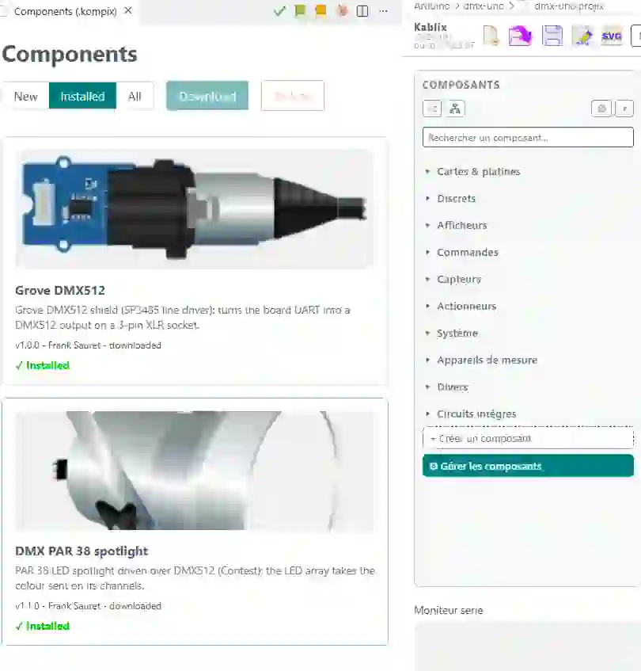

# Kablix — User guide


> Version française : [USAGE.md](../fr/USAGE.md)

## Contents

1. [Getting started](#getting-started)
2. [The interface](#the-interface)
3. [Building a circuit](#building-a-circuit)
4. [Simulating](#simulating)
  1. [Running code](#running-code)
  2. [MicroPython on the Pico](#micropython-on-the-pico)
  3. [Sending the program to a real Pico board](#sending-the-program-to-a-real-pico-board)
  4. [Debugging](#debugging)
  5. [Serial monitor](#serial-monitor)
  6. [Plotter](#plotter)
  7. [DMX512 lighting](#dmx512-lighting)
5. [Exporting the diagram as SVG](#exporting-the-diagram-as-svg)
6. [Creating your own parts](#creating-your-own-parts)
7. [Part file format (.kompix)](#part-file-format-kompix)
8. [Where to find existing parts](#where-to-find-existing-parts)
9. [Saving / opening a project (.projix)](#saving--opening-a-project-projix)
10. [Wokwi interoperability (diagram.json)](#wokwi-interoperability-diagramjson)
11. [Library updates](#library-updates)
12. [Keyboard shortcuts](#keyboard-shortcuts)

---

## Getting started

1. To start, click the  icon in the activity bar on the left;
  - Or, inside a project folder, double-click a projix file;
  - Or, if you set up the association, double-click a projix file in Windows Explorer.

The icon **only creates a new project when none is open**: if a circuit is already there — including one reopened on its own after you switched folders — it brings that one back instead of opening a second workbench.

<video src="../../media/demarrer.mp4" title="Start Kablix" controls autoplay loop muted playsinline></video>

1. **Build your circuit**: drag and drop a part from the palette on the left. Wire the pins directly and click the autoroute button (routes the selected parts, or the whole circuit if none is selected).

<video src="../../media/dessiner.mp4" title="Build a circuit" controls autoplay loop muted playsinline></video>

1. **Run your code**: associate a code file (note that `.ino` files must be inside a folder with the same name) then **▶ “Start”**:
  - `.ino`/`.c`/`.cpp` -> compilation through the local toolchain;
  - `.py` -> MicroPython on the simulated Pico (`.uf2` firmware required, see below);
  - `.hex` / `.uf2` / `.elf` / `.bin` -> loaded directly, no compilation.
  **▶ saves first**: the circuit and the code file are written to disk before the simulation starts, so what runs is always what is on disk. A project that was never saved (no name yet) is left alone — no dialog interrupts the launch.
2. **Save your circuit**: “Kablix: Save the project (.projix)”; a `.projix` then reopens with a double-click in Explorer. On reopening, the project's code file opens **too**, in the code pane next to the circuit — while the caret stays in Kablix. Import/export in the Wokwi format (`diagram.json`) are also available.

<video src="../../media/simuler.mp4" title="Simulate in Kablix" controls autoplay loop muted playsinline></video>

## The interface

  
*Kablix interface: **①** the parts **palette** on the left, **②** the circuit **canvas** in the center, **③** the **inspector** (Properties/variables) on the right, **④** the **serial monitor/Console/REPL**, **⑤** the **Plotter** at the bottom and **⑥** the **toolbars** — the Kablix one right at the top, the **simulation** one on the left of the canvas and the **drawing** one on the right.*

- **Palette**: clicking a part places it on the canvas. Two sort modes to choose from (buttons at the top) : alphabetical or by categories. A **“Recently used”** zone (10 max) can stay at the top (third button). The last button changes the palette's reaction mode.
- **Kablix toolbar** (at the top of the window)  

  - **Load binary**: loads an already-compiled .hex/.uf2 from the workspace, without recompiling. **Hidden by default** — the *Show the “Load binary” button* checkbox in Kablix's settings brings it back.
  - the usual file-management functions: **new project**, **open**, **save**, **save as**, **export the diagram as SVG**.
  - the **Names** button, which shows the name on the **selected** part or on all parts, or the parts' id (the reference).
  - **rearrange**: restores the Kablix layout (code on one side, Kablix on the other, panels closed). You can swap the two zones and set their width with the mouse, then use **Save this layout as the default** (hamburger menu): both the side of Kablix **and** the width are remembered, and “rearrange” restores them — including moving Kablix back to the chosen side if it has changed since.
  - the **hamburger menu** for less frequent functions: import / export a **Wokwi** diagram, export the **part list (CSV)**, update the **Pico firmware**, check for **library updates**, save the default layout.
  - access to this **help**.
  - the current **project name**.
  - the project's **code file**, right next to the name: **click = change**, **double-click = open** (it opens on the code side).
  - the **status** area (“Ready”, build messages…) and, only when the page can no longer keep up, the **“Slowed down: 0.45× real time”** badge.
- **Simulation bar** (on the left, over the canvas)  

  - **▶ start** (saves the diagram and the code first)
  - **■ stop**
  - **⏸ pause/resume**
  - **step**
  - the **speed** selector, one animal per setting: 🦅 500 %, 🐆 200 %, 🐇 100 % (real time), 🐢 10 %, 🐌 1 %. Speeding up is a **wish**: the simulation runs as fast as it can, never faster.
  - **REPL**: for Pico only, shows the traditional Python console (it only appears when the board on the canvas is a Pico)
  - **serial monitor / console**
  - **Plotter**
  - **fault explanations**: the red frame and the yellow label put on a faulty part. On by default; the button hides them when they get in the way of reading the diagram.
- **Drawing bar** (on the right, over the canvas)  

  - **part button**: shows the **internal schematic** of the selected part, or the **full pinout** of the board. It only appears when the selected part offers one.
  - **autoroute** routes the selection or the whole circuit
  - **grid** (show/hide)
  - **recenter/fit the view**
  - **⟲ reset all components**: puts every part back to its idle state (switches released, sliders at rest) without touching the wiring. **Hidden by default** — the *Show the “Reset all components” button* checkbox in the Kablix settings brings it back.
  - **eraser**: clears the whole diagram, parts and wires (Ctrl+Z undoes it). **Hidden by default** too — *Show the “Clear the diagram” button* checkbox.
- **Properties/Variables** (inspector):
  - While drawing, edits the selected part (color, value, angle…) or wire (Dupont color, deletion, node [equipotential])
  - during the simulation, shows the variables.
  - Parts with a lot of settings (the spider robot and its 33 of them) file their properties into **collapsible drawers**, all closed when the part is selected. They work as an **accordion**: opening one closes the one that was open.

## Building a circuit

### Placing and moving

- **Place**: click a part in the palette (placed at the center), or **drag and drop** it from the palette to wherever you want on the canvas.
- **Move**: drag the part (anywhere on its body), or **drag with the right click** — essential for interactive parts (button, potentiometer, switches, joystick) whose left click operates the control. The right click also goes **through the yellow dots**: a LED or a resistor plugged into a breadboard stays grabbable even when a hole lights up under the cursor. The left click, meanwhile, still starts a wire from that hole.
- **Rotate**: select the part then press **`+`** (45° clockwise) or **`-`** (45° counter-clockwise). Pins and wires follow; a reminder appears in the inspector help area.
- **Zoom**: **mouse wheel** over the canvas (centered on the cursor). The **⟳ %** badge at the bottom right gives the factor; clicking it resets the view. The **fit view** button frames the **drawing** of the circuit — not the invisible frames of the parts, which are bigger than what they show: a spider robot on its own now fills the screen instead of floating in the middle of a margin.
- **Delete**: 🗑 button in the inspector, or the `Del` key (or `Backspace`). It removes whatever is selected: a part, a wire, or a whole batch — parts **and** wires caught together in a selection rectangle. A single click on the sheet is enough to give it the keyboard back: even if you were just typing in the palette search box or in an inspector field, the key goes to the diagram. As long as the caret is blinking in a field, however, `Del` deletes text — which is what one expects.

**The sheet has edges, on all four sides.** It measures 4000 × 3000 px and a part cannot leave it: it stops at the edge, on the right and at the bottom as well as at the top and on the left. It is its **drawing** that hits the edge, not its invisible frame — a part whose drawing does not fill its frame (the robot's leg, for instance) therefore goes all the way up until it really touches the top. A selected batch stops **as a block**, as soon as one of its parts reaches an edge: relative positions are preserved. Repeated pastes (`Ctrl+D`) stop at the same place instead of dropping copies outside.

### Breadboard

The **Breadboard** part (Boards & breadboards category) comes in three sizes — *mini* (17 columns, no rails), *half* (30 columns) and *full* (63 columns) — set in **Properties**. Real internal connections are simulated: columns **a–e** and **f–j** joined per strip, **+/− rails** along the full length.

While dragging a part over the breadboard, the **strips that would receive its pins light up in yellow**. On release, the part **plugs in**: it snaps to the holes and the connections are made automatically (no visible wire). Wires are drawn over boards and breadboards.

### Wiring

1. Click a **pin** (golden dot): the wire starts.
2. Each click on the **canvas background** adds a **corner**. Segments close to horizontal or vertical (±15°) **snap** to the axis.
3. Click **another pin** to finish the wire. `Esc` cancels.
4. Direct pin-to-pin drag also works, and it is the method I recommend — autoroute does the rest.

Every change of direction is drawn with a **rounded corner**. Colors:

- a wire touching a **ground** (GND) starts **black**;
- a wire touching a **power rail** (5V, 3V3, VBUS, VSYS, VCC…) starts **red**;
- the others follow the rotation of the **rainbow Dupont ribbon** (10 colors).

The color stays **editable with one click** in the inspector — it is never re-imposed.

Some special parts (only the RGB LED for now) have preset initial colors (I'll let you guess which ones in that case).

### Reworking a wire

- **Select the wire**: **handles** appear on every corner.
- **Drag a handle** to move the corner.
- **Hold Ctrl** while dragging: a **horizontal/vertical crosshair** appears and the corner aligns with its neighbours — segments become exactly horizontal or vertical.
- **Double-click the wire**: inserts a new corner at that spot.

### Available parts

The palette holds **74 built-in parts** (plus their variants: polarized capacitor, PN2222A/NPN/PNP transistors, 3×4 and 4×4 keypads…). Each one has its **help sheet** — drawing, pinout, properties, what is simulated and what is not — opened by the **Part help** button of the inspector when the part is selected. More parts are added through the **library** (see [Component manager](#component-manager-install-and-uninstall)).

**Boards and supports**

| Part                                    | Simulated behavior                                                                |
| --------------------------------------- | --------------------------------------------------------------------------------- |
| Arduino Uno, Nano, Mega 2560            | Simulated AVR processor (avr8js): ATmega328P for Uno and Nano, ATmega2560 for Mega |
| Raspberry Pi Pico, Pico W               | Simulated RP2040 processor (rp2040js) running MicroPython                          |
| Grove Shield (Pico)                     | Expansion shield: Grove connectors wired to the Pico pins                          |
| Breadboard (mini / half / full)         | Conductive a–e / f–j strips and +/− rails, automatic plug-in                       |
| Bench power supply, power bank          | DC voltage sources (voltage set in Properties)                                     |

**Passives and semiconductors**

| Part                                             | Simulated behavior                                                                          |
| ------------------------------------------------ | ------------------------------------------------------------------------------------------- |
| Resistor                                         | Joins its two legs (value and angle editable, color code drawn)                              |
| Capacitor (non-polarized, polarized)             | Joins its two legs; the value is carried by the drawing                                      |
| Diode                                            | Conducts one way (drawing and cathode marker)                                                |
| Transistor (PN2222A, NPN, PNP)                   | Dressed TO-92 package: marking and internal schematic depend on the model                    |
| NTC / PTC thermistors, NTC temperature sensor    | Analog input: temperature set in Properties (or with a slider during the simulation)         |
| LDR / photoresistor                              | Analog input: brightness set in Properties                                                   |

**Indicators and displays**

| Part                              | Simulated behavior                                                                            |
| --------------------------------- | --------------------------------------------------------------------------------------------- |
| LED, RGB LED, 10-LED bar graph    | Lit according to net levels (anode high, cathode low), brightness accounting for the series resistor |
| 7-segment display                 | Segments A–G + dot, common cathode DIG1 (multiplexing followed)                                |
| NeoPixel, ring, matrix            | WS2812 protocol decoded bit by bit: the real color of every pixel                              |
| Text LCD (HD44780)                | Emulated controller: 4 or 8 bits, cursor, custom characters                                    |
| OLED display SSD1306              | Display memory decoded and drawn (SPI + DC + CS)                                               |
| TFT display ILI9341 (SPI)         | SPI rendering, orientation and write window followed                                           |

**Inputs**

| Part                                            | Simulated behavior                                                                        |
| ----------------------------------------------- | ----------------------------------------------------------------------------------------- |
| Pushbutton (standard, 6 mm)                     | Pulls the MCU pin LOW when pressed (wired pin ↔ GND)                                       |
| Slide switch                                    | Connects the common (2) to side 1 or 3                                                     |
| DIP switch ×8                                   | 8 independent channels (na ↔ MCU, nb ↔ GND)                                                |
| Membrane keypad (3×4, 4×4)                      | Row/column matrix: the key you click joins its row to its column                           |
| Potentiometer (rotary, slide, trimmer)          | Interactive analog input (A0–A5 on Uno, GP26–GP28 on Pico); the trimmer prints its value as a 3-digit code |
| Analog joystick                                 | 2 analog axes (VERT / HORZ) + SEL button                                                   |

**Sensors**

| Part                                       | Simulated behavior                                                                                     |
| ------------------------------------------ | ------------------------------------------------------------------------------------------------------ |
| Light, gas (MQ), flame and sound sensors   | Analog output AO and digital output DOUT (active low); level set with a slider during the simulation    |
| PIR sensor, tilt sensor                    | Digital output OUT; the PIR triggers when the mouse flies over it                                       |
| Hall effect sensor                         | Open-drain output S (active low), magnet dragged with the mouse during the simulation                   |
| Heart-beat sensor                          | Analog output: pulse rate set in Properties                                                             |
| Ultrasonic sensor (HC-SR04)                | Echo duration computed from the distance AND the speed of sound; two sliders during simulation (distance, air temperature) |
| Temperature / humidity (DHT11, DHT22)      | Full one-wire protocol (frame, parity); values set in Properties                                        |

**Actuators and power**

| Part                                  | Simulated behavior                                                                                  |
| ------------------------------------- | ----------------------------------------------------------------------------------------------------- |
| Buzzer                                | Animated note when a voltage exists across its pins                                                  |
| Servo motor                           | Horn positioned by the pulse width (PWM)                                                             |
| Fan, DC motor                         | Speed follows the voltage actually applied; under-voltage, insufficient current and over-voltage are reported on the diagram |
| Relay OMRON G5V                       | Coil pulling in at 80 % of its rated voltage, NO/NC contact; flyback diode mandatory                  |
| 16-channel PWM driver (PCA9685)       | Emulated I²C registers: 16 PWM outputs, provided the V+ terminal is powered                           |
| microSD card (SPI)                    | About 2 MB FAT16 card in memory: files read and written, contents lost on stop                        |

**Logic (DIP packages)**

| Part                                   | Simulated behavior                             |
| -------------------------------------- | ---------------------------------------------- |
| CD4001, CD4011, CD4070, CD4071, CD4081 | Quad CMOS NOR, NAND, XOR, OR, AND gates        |
| CD40106                                | 6 Schmitt-trigger inverters                    |
| 74xx00, 74xx02, 74xx08, 74xx32, 74xx86 | Quad TTL NAND, NOR, AND, OR, XOR gates         |
| 74xx14                                 | 6 Schmitt-trigger inverters                    |

**Mechanics**

| Part                     | Simulated behavior                                                                            |
| ------------------------ | --------------------------------------------------------------------------------------------- |
| Spider robot, spider leg | Full kinematics (33 settings, collapsible drawers in the inspector) driven by the servo motors |

### New parts

They can be downloaded through the **Manage components** button, so you can add and remove them as you need. The parts shipped with the extension cannot be removed. Sharing is easier too, since a whole part fits in a single file (`.kompix`): either download it through the manager, or simply drop the file into the project folder — it is added to the available parts automatically.

You can also add external part repositories.

> Warning: simulatable parts contain code. Check your sources.



## Simulating

### Running code

**Compile & run the active file** button (or the command of the same name) — the treatment depends on the extension of the active file:

| File                             | Treatment                       | Requirement                     |
| -------------------------------- | ------------------------------- | ------------------------------- |
| `.ino`, `.c`, `.cpp` (Uno board) | Local compilation then run      | `arduino-cli` **or** `avr-gcc`  |
| `.c`, `.cpp` (Pico board)        | Direct RAM compilation (no OS)  | `arm-none-eabi-gcc`             |
| `.py`                            | MicroPython on the simulated Pico | `.uf2` firmware (see below)   |
| `.hex`                           | Loaded directly (Uno)           | —                               |
| `.uf2`, `.elf`, `.bin`           | Loaded directly (Pico)          | —                               |

#### An unchanged sketch is no longer recompiled

The result of a build is kept **on disk**, filed under the checksum of the **contents** of the sources (the sketch folder and its `src/`, plus the target board and the Kablix version). Running a sketch you have not touched starts from the binary already produced: a few tens of milliseconds instead of tens of seconds. Changing a single source is enough to invalidate the entry, and the last 60 builds are kept.

> An Arduino build launches dozens of tools and writes as many object files: if it drags on your machine, it is most often the antivirus inspecting each one. Excluding `%LOCALAPPDATA%\Arduino15`, `%TEMP%\arduino` and the project folder changes everything.

#### On-board LEDs of the boards

During the simulation the board lights up like the real one: the **green ON LED** stays lit as long as the program runs, and the **L LED** — the one of `LED_BUILTIN`, pin **D13** on Uno, Nano and Mega — follows the state of that pin. A `blink` on `LED_BUILTIN` is therefore visible **without wiring a single LED**. On the Pico, the on-board **GP25** LED plays that part.

#### Simulation speed

The simulation follows **real time**: one second on screen is one second on the real board, `delay(1000)` really lasts a second. When the page is busy for a moment (a part being drawn, a serial monitor scrolling), the simulation **catches up** as soon as it gets the hand back; only long stalls (more than a quarter of a second, a tab left in the background) are given up — the time is then **skipped**, never replayed fast-forward.

The animal selector deliberately slows execution down — 🐢 10 %, 🐌 1 % of real time — to watch a fast phenomenon. The other way round, 🐆 200 % and 🦅 500 % **ask** for speed-up: the simulation then takes everything the machine can give, but it only goes past real time on a program that lets the core sleep. 🐇 100 % is real time.

If the board still cannot keep up, a **“Slowed down: 0.45× real time”** badge appears on the right of the status bar: the page is too loaded for the simulation (large diagram, busy machine). The deliberate slow-down of the selector does not count as a fault. The badge disappears as soon as the simulation is on time again, and on stop.

#### Faulty parts: red frame and explanation

When the simulation detects a wiring mistake or a destroyed part, it **surrounds the culprit with a red frame** on the diagram and shows **next to it a yellow label on a red background** explaining the problem and what to fix. The status bar only keeps the last sentence: the label stays, before your eyes, in the right place.

| What Kablix sees                       | What the label says                                                                                |
| -------------------------------------- | ---------------------------------------------------------------------------------------------------- |
| Flyback diode fitted backwards         | Diode reversed                                                                                       |
| Relay without a flyback diode          | The coil sends a voltage spike back when it opens; it destroys the driving transistor, the diode absorbs it |
| Under-powered coil                     | The relay does not pull in: power the coil at its rated voltage                                      |
| Supply too weak for the coil           | Raise the maximum current, or put fewer coils on the same source                                     |
| Motor without a flyback diode (💥)     | A motor is a coil: the switch-off spike destroys the driving transistor, the diode absorbs it        |
| Supply too weak for the motor          | A board pin is nowhere near enough: go through a power supply and a transistor                       |
| Over-driven motor (💥)                 | More than 1.5 times its rated voltage: its windings cannot take it                                   |
| Burnt LED (💥)                         | Without a series resistor (or with too small a one), the current exceeds what the junction can take  |
| Blown capacitor (💥)                   | Working voltage exceeded: use one with a higher rating                                               |
| Burnt 16-servo board (💥)              | The V+ terminal accepts 5 V, no more                                                                 |

The frame and the label only appear **during the simulation**; they disappear as soon as the fault is fixed, and on stop.

### Adding libraries
The Raspberry Pi Pico and the Arduino boards work differently, because of their software architecture and the way they handle memory.
Arduino compiles the C++ code into machine language before sending it. The Pico (in MicroPython) carries a live interpreter that reads the script files directly.

#### Arduino
Because of the compilation, the library has to be installed on the PC that will upload the program to the Arduino board. That part is easy: start "Arduino VsCode IDE" by clicking its icon in the activity bar , the command panel opens. Click the library manager , search for the library and install it. Once done, it stays available for all your projects.
#### Pico pi
It is quite different for the Pico boards in MicroPython. Your library must sit in the same folder as the program that calls it (other ways exist, but let us keep it simple). It must also be present on the board itself. The "send to the Pico" button sends the libraries the program needs, provided they are in the folder.
The following modules are built into the MicroPython of the Pico boards: machine, rp2, framebuf, neopixel, time, math, cmath, os, gc, sys, struct, uctypes, json, network, socket, bluetooth (note that the last three need a model fitted with Wi-Fi/Bluetooth, such as the Pico W or the Pico 2 W). **In simulation**, the Wi-Fi chip is not emulated: Kablix replaces `network` with a façade and relays the real HTTP requests (`urequests`) through the host, while `socket` and `bluetooth` stay outside the simulation — see the [Pico W](composants/picow.md) sheet.
The Pico is above all a microcontroller. You can therefore also program it in C, and Kablix allows it (Pico and Pico W; the RP2350 of the Pico 2 is not ported yet), but I have not built a development suite for that. Raspberry Pi provides one, so I recommend installing their extension.

### MicroPython on the Pico

1. Open a `.py` file → **Compile & run the active file**.
2. On the first run, if no firmware is found, Kablix **offers to download it automatically** (choice of **Pico / Pico W**) from [micropython.org](https://micropython.org/download/RPI_PICO/). The firmware is stored in the extension storage and **reused in all your projects** — the question is asked only once.

To provide your own firmware (offline, a specific version…): put an official `.uf2` **in the workspace** (any folder) or set its path in the **`kablix.micropythonUf2`** setting; it then takes priority.

> ⚠ **Fully offline operation.** So that a machine without Internet never has to download the firmware, **put the `.uf2` in the project folder**: it will be versioned and shipped with the project. Kablix looks for the firmware **in the workspace first**, then in the downloaded/stored firmware, and only offers the download as a last resort. A project that carries its firmware is thus reproducible and self-contained.

The firmware boots inside the simulator (bootrom + flash + USB), then the script is injected through the **raw REPL**. `print()` calls appear in the serial monitor; at the end of the script the **interactive REPL** stays available through the input field or by clicking the REPL button.

### Sending the program to a real Pico board

When a `.py` file is open, an **⬆** button appears in its tab bar. One click sends the program to the board plugged in over USB, **renamed `main.py`**: the board will therefore run it on its own at every power-up.

- **The button lights up on its own.** Greyed out, no board is seen; Kablix looks every 4 s at the USB ports whose manufacturer is Raspberry Pi (identifier `2E8A`), which avoids mistaking the board for the motherboard's COM1 port. Plug the board in and the button lights up with nothing else to do.
- **Only the modules actually used go with it.** Kablix reads the `import` statements of the program, then the `import` statements of those modules, and so on: a folder holding fifty `.py` files only sends the handful the program really needs. A module filed under `lib/` keeps its location on the board. This is exactly the list the simulator uses: **what runs in Kablix runs on the board**.
- **Nothing is asked when there is a single file.** As soon as there are several, a list opens and you can uncheck what you do not want to send (the main program always goes).
- **An unchanged file is not rewritten.** The comparison is made on the contents (SHA-256 fingerprint), not on the date: the Pico clock is not saved when powered off and restarts in 2021 at every boot.

> The transfer uses Python 3 and **pyserial** (`pip install pyserial`). Close any serial monitor (Thonny, terminal…) that would hold the port, otherwise the board is unreachable. The details of the upload are shown in the **Kablix — Pico upload** output.

### Debugging

- **⏸ Pause / ▶ Resume**: freezes the simulation; the state of the pins and the LEDs stays displayed. The animal selector (🦅 500 % → 🐌 1 %) sets the execution rate.
- **Step**: runs one line of the source file then pauses again. The **Variables** panel then shows the current line and the global variables of the program; the line is also highlighted in the VS Code editor. A variable that has just changed is shown in red.
- **Breakpoints**: click in the editor gutter (left of the line numbers) before or during execution; the simulation pauses when it reaches the line. Breakpoints can be conditional.

Requirements and limits:

| Language            | How                                                                                      | Limits                                                                                          |
| ------------------- | ---------------------------------------------------------------------------------------- | ------------------------------------------------------------------------------------------------ |
| C / Arduino (Uno)   | Debug data extracted at build time (`avr-objdump`, shipped with arduino-cli or avr-gcc)  | simple **global** variables (int, float, bool…); a long `delay()` advances in 0.25 s simulated slices |
| MicroPython (Pico)  | the script is instrumented automatically before injection                                | **global** variables only; the pause takes effect on the next line; no slow motion               |

Artifacts loaded directly (`.hex`, `.uf2`, `.elf`, `.bin`) run without debug information: pause and slow motion remain available, step-by-step does not.

#### Hiding variables

A program often exposes uninteresting variables (constants, configuration objects) that drown the two or three you are watching. The **Variables** panel lets you sort them out:

- **Hide**: click the **👁** on the left of the variable (tooltip “Click to hide”). The variable disappears from the panel.
- **Show again**: click the **🔍 Variables ▾** title — the drop-down list of the currently hidden variables opens. Clicking one puts it back in the panel; **Show all** puts them all back.
- **Remember**: nothing more to do. The list of hidden variables is filed **in the project** (`.projix`) and reapplied when it is reopened. It is written at the next **save** of the project, exactly like the page framing: hiding a variable does not mark the project “modified”.

A hidden variable keeps being **tracked** in the background: when it comes back, its red (“changed at the last step”) is exact, as if it had never left the panel. As long as the project is not saved, the hidden state holds for the open workbench — it survives stopping and restarting the simulation.

#### Display base of a variable

A bit mask or a register reads better in binary than in decimal. The name and the value of a variable are **clickable** (the cursor turns into a hand): a **click** opens a menu offering four display bases: **Binary**, **Hexadecimal**, **Decimal** (the default) and **Character**. The chosen base is ticked ✓. The right click opens the same menu.

The value then carries the **prefix** of its base — the same as in C or Python, so it can be typed straight back into the program — and its digits are grouped for readability:

| Base        | `160` shown as | Grouping  |
| ----------- | -------------- | --------- |
| Binary      | `0b 1010 0000` | 4 bits    |
| Hexadecimal | `0x A0`        | 4 digits  |
| Decimal     | `160`          | 3 digits  |
| Character   | `' '`          | —         |

The group separator, like the one detaching the prefix, is a **narrow no-break space**: groups stand out at a glance and the number never breaks at the end of a line, even in a narrow panel.

In **Character**, control codes come out escaped (`'\n'`, `'\t'`, `'\0'`…), other values outside the printable range as `'\x1f'`. Values that are not integers (floats, strings, lists, objects) are left **as they are** whatever base is chosen. In every case, the tooltip of the value recalls the raw form.

The choice applies to **that variable** and is remembered **in the project**, like the hidden ones: when the `.projix` is reopened, every variable finds its base again. Since these settings are part of the file, changing them marks the project **to be saved** (the ● dot on the tab): `Ctrl+S` writes them.

### Serial monitor

- **Output**: USART (Uno), USB-CDC and UART0 (Pico), in real time.
- **Input**: input field + `Enter` (or the Send button). On the Pico, the input feeds the USB-CDC (MicroPython REPL) **and** UART0.
- **Build errors**: when the program does not compile, the **full** compiler messages are shown here, under a `── Build failed ──` heading (the monitor unfolds on its own if it was collapsed). The notification bubble only recalls the **first** error — `file.ino:12: 'digitalWrit' was not declared in this scope`: it is almost always the one to fix first, the others follow from it.

### Plotter

Panel at the bottom of the screen: shows numeric quantities in real time, without leaving Kablix or adding a dependency.

Two sources are plotted automatically:

- **Telemetry from the program**: every line in the **Teleplot** format `>name:value` (optional unit `§u`) emitted on the serial port becomes a curve. Compatible with the Teleplot tool on real hardware — the same sketch plots here and there. Those lines are **absorbed** by the plotter: they do not clutter the serial monitor.
- **Internal probes**: the voltage each analog sensor puts on its pin is plotted **without a single line of code** in the sketch (stepped plot, the value holds between two changes). The curve is named after the **converter channel followed by the pin** — `ADC0 (A0)` on Arduino, `ADC0 (GP26)` on Pico — so you can spot at a glance the `analogRead(A0)` or the `machine.ADC(0)` of the program.

Emission examples:

| Language            | Line                                                                |
| ------------------- | ------------------------------------------------------------------- |
| C / Arduino         | `Serial.print(">temp:"); Serial.println(t);`                        |
| C / Arduino (unit)  | `Serial.print(">voltage:"); Serial.print(v); Serial.println("§V");` |
| MicroPython         | `print(">temp:{}".format(t))`                                       |

Panel controls:

- **Window**: displayed duration (5, 10, 30 or 60 s), sliding window following real time.
- **⏸ / ▶**: freezes the display; collection continues in the background.
- **Legend chips**: click to hide/show a curve; the current value is shown live on it.
- **Hover**: crosshair + tooltip with the value of every curve at the pointed instant.
- **CSV**: exports all series (long format `time ; quantity ; value ; unit`, separator and decimal mark following the language — opens directly in a localized Excel).
- **Clear**: empties the curves.

When the simulation stops, the curves stay displayed for analysis.

### DMX512 lighting

Kablix simulates a **DMX512 line** end to end: the program sends the frame, the decoder reads it, and the **fixture really lights up** in the requested color.

The circuit uses two parts from the **library** (to be installed through **⚙ Manage components**):

- **Grove DMX512** — the interface: its **SIG** input is wired to a board pin, its output is the differential pair **+** / **−**;
- **PAR 38 fixture** — the luminaire: its **+** / **−** legs join those of the interface and **GND** closes the shield. **Both wires of the pair must follow**: a fixture connected by Data+ alone is not recognized, it is half wired.

The **DMX address** of the fixture is set in the inspector (**Properties → DMX address**, 1 to 512). Three channels are consumed from there: red, green, blue. Several fixtures can listen to the same line, each at its own address — that is the whole point of DMX.

Both ways of transmitting are recognized:

- **Hardware UART** — `Serial.begin(250000, SERIAL_8N2)` on Arduino (pin 1; on Mega also 18, 16 and 14), `machine.UART(0, …, stop=2)` on Pico (GP0). The frame-opening BREAK is done by hand, as on a real board. The 513 bytes of the frame **do not reach the serial monitor**: the console would be unreadable.
- **Bit-bang library** — **DmxSimple** and the like, which produce the frame by hand on an **ordinary pin** (3 by default). Kablix then decodes the **wire** itself, edge by edge: an off-the-shelf program works without being modified.

> Only start code 0 (lighting) is kept: a `Serial.println` on the same pin therefore lights no fixture.

## Exporting the part list (CSV bill of materials)

Hamburger menu → **“Export the part list (CSV)”**. One line per part, five columns:

| Reference | Part                | Type         | Value   | Comment                                          |
| --------- | ------------------- | ------------ | ------- | ------------------------------------------------ |
| `C2`      | Electrolytic capacitor | `condo-p-1` | `10 µF` | `Max voltage: 400 V`                           |
| `R1`      | Resistor            | `resistor`   | `10 kΩ` | `Power: 0.25 W`                                  |
| `T1`      | Transistor          | `transistor` |         | `Vce max: 40 V · Current gain (β): 100 · …`      |

- **Value**: the one you read on the part, with its unit and prefix (`10 µF`, `100 kΩ`, `4.7 mH`). A part that has none — a transistor, a display — leaves the cell empty.
- **Comment**: all the other characteristics of the inspector, separated by `·`, in the form `Max voltage: 400 V`.
- The three capacitors are told apart by their name: **film**, **tantalum** or **electrolytic**.
- The list is sorted by family then by number (`R2` before `R10`), and the suggested file is called **`<project name>.csv`**, next to the project.

Separator `;`, UTF-8 mark and CRLF line endings: the file opens straight away in a spreadsheet.

## Exporting the diagram as SVG

**SVG floppy disk** button: the whole diagram (parts with their rotations, colored wires with their rounded corners) is exported as a **standalone SVG file** through a save dialog. Usable in a document, a website, a printout…

> Note: a few parts styled by internal CSS may lose cosmetic details on export; the geometry and the main colors are preserved.

## Creating your own parts

> ⚠ Experimental ⚠

> Detailed guide: [Editing the SVG of the parts and their internal schematics](Editing-svg-components.md) — reworking the SVG drawing, the 10 px grid, and editing the internal schematics (K view).

**“+ Create a part”** button at the bottom of the palette: a full-screen window opens, with the form on the left and **two previews** on the right (external view and internal view). The **zoom** buttons at the top (−, %, +, ⛶ *fit*) scale both previews.

**1. Name and category.** The name is the label shown in the palette. The category chooses the palette section the part is filed in (Boards, Passive, Displays & LEDs, Controls, Sensors, Actuators, Systems, Instruments, Misc, Integrated circuits); left empty, it goes to **Custom parts**.

**2. Simulation model.** Defines the electrical behavior:

| Model                        | Pin roles                    | Behavior                                        |
| ---------------------------- | ---------------------------- | ----------------------------------------------- |
| LED                          | `A` (anode), `C` (cathode)   | Light halo when A=high and C=low                |
| Pushbutton                   | `1.l`, `2.l`                 | Click on the drawing = press (pin pulled to GND) |
| Resistor                     | `1`, `2`                     | Electrically joins its two pins                 |
| Buzzer                       | `1`, `2`                     | Halo when a voltage exists across the two pins  |
| Digital source               | `OUT`                        | 0/1 state set in Properties                     |
| Analog source                | `AO`                         | 0–100 % value set in Properties                 |
| Ultrasonic sensor HC-SR04    | `TRIG`, `ECHO`               | Distance echo (adjustable)                      |
| I²C LCD display (HD44780)    | — (I²C bus)                  | Screen driven by the I²C bus                    |
| I²C PWM driver (PCA9685)     | — (I²C bus)                  | 16 PWM outputs on the I²C bus                   |
| I²C OLED display (SSD1306)   | — (I²C bus)                  | I²C graphic screen                              |
| SPI OLED display (SSD1306)   | `DC`                         | SPI graphic screen                              |
| Decorative                   | —                            | No behavior (annotation, dressing)              |

The **⇪** button next to the list imports extra **simulation models** from a `.json` (roles and attributes pre-assigned); they are added under “Imported models” and are persisted.

**3. External drawing.** **“Load an SVG…”** button: load the drawing from an `.svg` file. Kablix reads the **convention markers** placed in the SVG (under Inkscape for instance) and removes them from the final part:

- **red circle** (opacity 0.8) = a pin → detected and placed automatically;
- **red text** near a pin = its name (it becomes the tooltip);
- **green circle** (opacity 0.5) = alignment anchor of the internal view (see 5).

Without red markers, **click the preview** to place every pin by hand.

> ⚠ Pins must sit on a 10 px grid, without exception.

**4. Connection points.** The list under “Connection points” lets you **rename** every pin, adjust its **x / y** coordinates to the pixel, or remove it (✕). A click on the external preview always adds a point.

**5. Internal view (optional).** **“Load an SVG…”** button of the internal column: a second drawing (schematic view) shown when the part is opened. It is aligned on the external view through the **green circle** (anchor) present in both SVGs — identical scales required. The **Overlay** checkbox controls the alignment on the external preview; **✕** removes the internal view.

**6. Definition parameters** (**＋** button). Named numeric fields (nominal value of a resistor, etc.): they appear in the part inspector **and** become variables reusable in the characteristic of the simulation control.

**7. Simulation control.** Adds to the part, during the simulation, a **slider** (analog output) or a **switch** (digital output):

- **Slider**: label, unit, min / max / step, and a **characteristic** — an expression giving the output voltage **in volts** as a function of `x` (slider position) and the parameters defined in 6. Empty = linear ramp min→max. The expression is validated live.
- **Switch**: a label, 0/1 output.

**8. Save.** The part appears in the palette (★) and is **persisted across sessions**. The **“Submit to Kablix…”** button explains how to share the part (GitHub “Submit new component” issue or pull request).

Management from the palette: **click** = place on the canvas, **double-click** = reopen the creator to edit, **⇩** = export as `.kompix`. The ⇩ only appears on a part **made here** (marked with ★): for one that comes from the library, its `.kompix` already exists at the publisher's. **Deletion** is no longer in the palette — it lives in **⚙ Manage components** (the highlighted button at the bottom of the palette), which lists what is really installed and asks for confirmation.

### Component manager (install and uninstall)

The **⚙ Manage components** button, at the bottom of the palette (or the **Kablix: Download components** command), opens the list of parts, which can be filtered:

- **New**: what the repositories offer and that is not installed yet;
- **Installed**: everything the local library holds, including the parts created here and those no repository offers;
- **All**: both.

A card may carry the **Experimental** mention (a badge and a dashed frame): the part is published and it works, but it is not settled yet — its drawing, its pins or its simulation may change from one version to the next. Nothing stops you from using it; just expect to have to bring it up to date.

You select cards with a click, then **Download** installs and **Delete** uninstalls. Deleting asks for confirmation, erases the `.kompix` file from the library and removes the part from the palette **and** from open diagrams. It is final: reinstalling goes through the original repository, or through a `.kompix` exported beforehand (**⇩**).

Where installed parts live: in a folder **shared by every Kablix project** on the machine — by default `%APPDATA%\Code\User\globalStorage\electropol-fr.kablix\kablix_components` on Windows (`~/Library/Application Support/Code/User/globalStorage/...` on macOS, `~/.config/Code/User/globalStorage/...` on Linux). The **Kablix › Components Folder** setting points to another one, and the **Kablix: Open the component library** command opens the one really in use, whether the setting is filled in or not. The repositories the manager queries are set the same way (**Kablix › Component Repositories**).

## Part file format (.kompix)

A Kablix part is stored in the **`.kompix`** format — a self-contained ZIP archive holding:

- Metadata (`manifest.json`)
- External drawing (`schema.svg`)
- Optional: internal schematic, thumbnail, simulation code

See [kompix_specification.md](../kompix_specification.md) for the full details.

### Creating your own parts

1. **Built-in creator** (palette → **+ Create a part**):
  - Import an SVG (external drawing + optional internal schematic)
  - Place the pins with a click
  - Configure the simulation model (kind, roles, attributes)
  - **Save** creates a `.kompix` in the local library
  - **⇩** exports a `.kompix` file (save as)
2. **From an AI prompt**:
  - Copy the prompt below
  - Ask Claude, ChatGPT, etc. for a base JSON
  - **Import** the JSON into the creator
  - Finish it and **Save**

Prompt to generate a part (copy it and fill in the first line):

```json
{
  "type": "custom-m4k2xyz",
  "label": "My special LED",
  "kind": "led",
  "svg": "<svg width=\"40\" height=\"56\" xmlns=\"http://www.w3.org/2000/svg\">…</svg>",
  "pins": [
    { "name": "plus",  "x": 12, "y": 50 },
    { "name": "minus", "x": 28, "y": 50 }
  ],
  "pinRoles": { "A": "plus", "C": "minus" },
  "attrs": {}
}
```

| Field                     | Type   | Description                                                                                                                                                                             |
| ------------------------- | ------ | ----------------------------------------------------------------------------------------------------------------------------------------------------------------------------------------- |
| `type`                    | string | Unique identifier. Generated automatically when absent at import time.                                                                                                                   |
| `label`                   | string | **Required.** Name shown in the palette.                                                                                                                                                 |
| `kind`                    | string | Simulation model: `led`, `pushbutton`, `resistor`, `buzzer`, `digital-source`, `analog-source` or `passive` (default).                                                                   |
| `svg`                     | string | **Required.** Full SVG code of the drawing (`<svg>` tag with `width`/`height` in pixels).                                                                                                |
| `pins`                    | array  | **Required.** Connection points: `name` (unique), `x`, `y` in pixels **relative to the top-left corner of the drawing**.                                                                 |
| `pinRoles`                | object | Mapping *model role* → *pin name* (see the model table). When absent, the pins must carry the role name directly.                                                                        |
| `attrs`                   | object | Initial attributes. For `digital-source`: `{ "state": "0" }`; for `analog-source`: `{ "value": "50" }`.                                                                                  |
| `category`                | string | Palette section (`Boards`, `Passive`, `Displays & LEDs`, `Controls`, `Sensors`, `Actuators`, `Systems`, `Instruments`, `Misc`, `Integrated circuits`). Absent = “Custom parts”.          |
| `params`                  | array  | Definition parameters: `name` (identifier), `label`, `value` (number). Inspector fields, reusable in `control.expr`.                                                                     |
| `control`                 | object | Simulation control: `{ "type": "slider", "label", "unit", "min", "max", "step", "expr" }` (voltage in volts, `expr` as a function of `x` and the `params`) **or** `{ "type": "switch", "label" }`. |
| `innerSvg`                | string | Optional internal view (schematic shown when the part is opened).                                                                                                                        |
| `innerOffset`             | object | `{ x, y }` offset of the internal view in the frame of the external drawing (alignment).                                                                                                 |
| `extAnchor` / `intAnchor` | object | Green anchors `{ x, y }` measured at import time; they recompute the alignment when a single SVG is re-imported.                                                                         |

The `kind` values available for the complete I²C/SPI modules are also: `ultrasonic` (HC-SR04, roles `TRIG`/`ECHO`), `i2c-lcd`, `i2c-pwm`, `i2c-oled` (I²C bus, no role), `spi-oled` (role `DC`).

Tips for the SVG drawing:

- Give reasonable `width`/`height` (40–200 px): that is the display size on the canvas.
- Avoid `<style>` and scripts; prefer presentation attributes (`fill`, `stroke`…) — they survive the SVG export of the diagram.
- Draw your connection dots visually where you declare the `pins`.

### Letting an AI generate a part

Copy the prompt below into your favourite AI assistant (Claude, ChatGPT…), fill in the first line, then import the resulting JSON through **⇪ Import (.json)**:

```text
Create a part for the Kablix simulator: [DESCRIBE YOUR PART HERE, e.g. “a 5V relay module with an indicator LED”].

Answer ONLY with a valid JSON file (no text around it), in the format:

{
  "label": "<short name shown in the palette>",
  "kind": "<simulation model, see list>",
  "svg": "<full SVG drawing on a single line>",
  "pins": [ { "name": "<name>", "x": <px>, "y": <px> } ],
  "pinRoles": { "<role>": "<pin name>" },
  "attrs": {}
}

Constraints:
- "kind" among: "led" (lit when role A=high and C=low), "pushbutton" (click =
  pin pulled to GND, roles 1.l and 2.l), "resistor" (joins roles 1 and 2),
  "buzzer" (active when a voltage exists across roles 1 and 2), "digital-source"
  (digital output, role OUT, state set by the user), "analog-source" (analog
  output, role AO, 0-100 % value set by the user), "passive" (decorative, no
  role).
- "pinRoles": maps every role of the chosen kind to the "name" of one of your pins.
- "attrs": { "state": "0" } for digital-source, { "value": "50" } for
  analog-source, {} otherwise.
- The SVG: <svg> tag with width/height in pixels (60 to 200), presentation
  attributes only (fill, stroke…), no <style> and no script, no typographic
  quotes. Draw golden dots (circles ~4 px) at the exact positions of the
  declared pins.
- The x/y coordinates of the pins are in pixels from the top-left corner of the SVG.
- Escape the quotes inside the "svg" value properly.
```

The matching help (roles, fields, constraints) is in the [Part file format](#part-file-format-kompix) section — the prompt repeats the essentials so the AI needs no other context.

## Where to find existing parts

- **Built into Kablix**: the whole palette (see the table above) — based on [@wokwi/elements](https://github.com/wokwi/wokwi-elements) (MIT licence), visual gallery at [elements.wokwi.com](https://elements.wokwi.com).
- **SVG drawings for your custom parts**:
  - [Wikimedia Commons](https://commons.wikimedia.org/wiki/Category:Electronic_component_symbols) (electronic symbols, free licences);
  - [SVG Repo](https://www.svgrepo.com) and [Openclipart](https://openclipart.org) (free drawings);
  - the sources of [wokwi-elements](https://github.com/wokwi/wokwi-elements/tree/master/src) contain the SVG of every part (MIT — reusable in a custom part);
  - [Fritzing](https://github.com/fritzing/fritzing-parts) (“breadboard” views in SVG, CC-BY-SA licence).
- **Sharing**: an exported part (`.kompix`) can be dropped into the library folder of another machine (**Kablix: Open the component library**), or published on a repository so that **⚙ Manage components** offers it for download.

## Saving / opening a project (.projix)

A **Kablix project** gathers in a single `.projix` file (a ZIP archive) **the diagram** (parts, wires, custom parts) and the target **board**. The `.projix` is light and self-contained — ideal to archive, share or hand in a diagram. It **does not carry the code**: the code file is only **referenced** (by its path), it stays on the machine.

- **💾 Save the project** (toolbar button or the **“Kablix: Save the project (.projix)”** command): choose where the `.projix` file goes. Kablix puts the current diagram, the custom parts in use and the board in it. The associated code file (if any) is remembered as a **reference** in the manifest; its contents are not copied into the archive.
- **`Ctrl+S`** does exactly what the 💾 button does: on a project that was **never saved** and that already has a code file, the suggested name is the one of the **code** (`my-program.py` → `my-program.projix`), not “New project”. On a project that already has a name, it rewrites the file without asking anything.
- **📂 Open a project** (button or the **“Kablix: Open a project (.projix)”** command): select a `.projix`. The diagram and the board are reloaded in the simulator. If a code file was referenced, Kablix tries to find it again on the machine, in this order: the relative path next to the `.projix`, then in every workspace folder, then the **program named after the project** sitting next to it (`my-project.ino` or `my-project.py`), and finally the absolute path remembered when saving.
- **Save as** into another folder: the **library parts** used by the diagram are engraved again into the new archive (so the circuit opens whole even on a machine where they are not installed), and the program adopted is the one **named after the project** if it exists next to it — otherwise the workbench would keep compiling the sketch of the original project.

Contents of a `.projix` archive:

| Entry          | Role                                                                                                |
| -------------- | ----------------------------------------------------------------------------------------------------- |
| `kablix.json`  | Manifest: format, version, app version, board, date, **reference** of the code file                   |
| `diagram.json` | Diagram (parts + wires), custom parts **and the drawings of the library parts** in use                |

> ⚠ The code is **not included** in the `.projix`: only the diagram is archived. To share the code too, hand the source file over next to the `.projix`.

## Wokwi interoperability (diagram.json)

The built-in parts of Kablix are the **@wokwi/elements** elements (same types, same pin names), which allows exchanging diagrams with the **Wokwi** project format (`diagram.json`).

- **Export** (hamburger button or command palette → **“Kablix: Export the Wokwi diagram (diagram.json)”**): writes the current diagram in the Wokwi format.
- **Import** (hamburger button or **“Kablix: Import a Wokwi diagram (diagram.json)”**): loads a `diagram.json`; the Wokwi types Kablix does not support are ignored (their number is shown in the status bar).

> ⚠ **Flipping** (flipH/flipV) and **wire corners** have no standard equivalent in `diagram.json`: Kablix keeps them in a `kablix` extension block (a key Wokwi ignores), so that a Kablix → diagram.json → Kablix round trip restores them identically. Opened in Wokwi, the diagram stays valid (standard parts and links), simply without the flipping and the corners.
> Remaining limit: Kablix **custom parts** (`kablix-custom-part`) and unknown Wokwi types are not converted (ignored, counted in the status bar).

## Library updates

Kablix embeds three simulation libraries (`avr8js`, `rp2040js`, `@wokwi/elements`). The extension is **offline by default**: no remote service is contacted without your agreement.

- **Manual check**: command palette (`Ctrl+Shift+P`) → **“Kablix: Check for library updates”**. Kablix then queries the npm registry and tells you whether a newer version exists (or that everything is up to date).
- **Check at startup** (optional): turn on the **`kablix.checkUpdatesOnStartup`** setting (off by default). A notification then only appears when an update is available, silently otherwise.
- **The notification offers three answers**: **Install** (opens the npm page; inside the extension repository, it runs `npm install` directly), **Later** (it comes back at the next start) and **Not this version** (that one is never offered again; an even newer one will be). The manual check always answers — even on a refused version.

> **Warning**: updating those libraries may **break the extension** (API changes). If anything goes wrong, open an issue on the GitHub repository: [github.com/FrankSAURET/kablix/issues](https://github.com/FrankSAURET/kablix/issues). A missing or failed network check stays silent and does not affect offline operation.

## Recommended extensions

Kablix **simulates**; those two extensions take care of the rest of the chain and pair well with it. They are **optional** — Kablix works on its own.

| Extension                                                                                                                  | What it is for                                                                              |
| -------------------------------------------------------------------------------------------------------------------------- | --------------------------------------------------------------------------------------------- |
| [`electropol-fr.arduino-vscode-ide`](https://marketplace.visualstudio.com/items?itemName=electropol-fr.arduino-vscode-ide) | Arduino toolchain inside VS Code: boards, libraries, compilation and **upload to the real board** |
| [`raspberry-pi.raspberry-pi-pico`](https://marketplace.visualstudio.com/items?itemName=raspberry-pi.raspberry-pi-pico)     | Raspberry Pi Pico in MicroPython: sending files to the board, hardware REPL                    |

Kablix offers them **only once**, at its first activation. To come back to them: command palette (`Ctrl+Shift+P`) → **“Kablix: Recommended extensions”**.

### The board chosen in Kablix becomes the one of the Arduino project

If **`electropol-fr.arduino-vscode-ide`** is installed, choosing **Uno**, **Nano** or **Mega** in the Kablix board selector chooses it **on its side too**: your `.ino` sketch is recognized at the same time (language, IntelliSense, compilation, upload), without going to pick the board again in the other extension. This also applies when a `.projix` project is opened — the board saved in it is carried over.

The setting of the other extension is a file: **`.vscode/arduino.yaml`**, where Kablix writes two lines, `board` (the full board identifier, for instance `arduino:avr:mega`) and `configuration` (the processor option, `cpu=atmega2560`). Everything else in the file — sketch, port, output folder — is left untouched.

Three safeguards:

- **Pico and Pico W touch nothing**: they are MicroPython boards, the Arduino board already chosen is not erased.
- **No file is sown** in a folder that has nothing to do with Arduino: Kablix only writes when `.vscode/arduino.yaml` already exists or when the folder holds an `.ino` sketch.
- **Nothing is rewritten** when the board is already there.

To turn the synchronization off: the **`kablix.syncArduinoIdeBoard`** setting (on by default).

### Nothing underlined in red in your code any more

An `.ino` sketch is not desktop C++, and a MicroPython program is not desktop Python. Without a hint, the VS Code analyzer knows neither `Serial` nor `pinMode` on one side, nor `machine` nor `neopixel` on the other: everything ends up underlined although the program is fine. Kablix sets that hint on its own, because it knows which board you picked.

- **Arduino board** (Uno, Nano, Mega): right after writing the board into `.vscode/arduino.yaml`, Kablix asks **`electropol-fr.arduino-vscode-ide`** to rebuild its IntelliSense configuration for that very board. That extension owns `.vscode/c_cpp_properties.json`; Kablix never touches it.
- **Pico board** (Pico, Pico W, Pico 2, Pico 2 W): Kablix points Pylance at the **MicroPython declarations** shipped with the **MicroPico** extension (`paulober.pico-w-go`). Three settings are added to the workspace folder's `.vscode/settings.json`: `python.analysis.extraPaths`, `python.analysis.typeshedPaths` and `reportMissingModuleSource` set to `none` — the last one because those declarations are `.pyi` files with no source code: the real module lives inside the chip, so not finding it on disk is expected.

Three safeguards here too:

- **Nothing is overwritten**: your own paths and your own diagnostic settings are kept, Kablix only adds what is missing.
- **Nothing is written** when the matching extension is not installed, or when everything is already in place.
- **Once per board and per folder**: reopening a project does not redo the work.

To turn this off: the **`kablix.syncIntelliSense`** setting (on by default).

> The **`raspberry-pi.raspberry-pi-pico`** extension targets the Pico C/C++ SDK, not MicroPython: it plays no part in what gets underlined in a `.py` file. **MicroPico** is the one that brings the declarations.

## Keyboard shortcuts

| Key                                  | Action                                                                                |
| ------------------------------------ | ------------------------------------------------------------------------------------- |
| `+` / `=`                            | Rotate the selected part by +45°                                                      |
| `-`                                  | Rotate by −45°                                                                        |
| `Del` / `Backspace`                  | Delete the selection: a part, a wire, or a whole batch (parts **and** wires)          |
| `Esc`                                | Cancel the wire being drawn / deselect                                                |
| `Ctrl` (while dragging a handle)     | Crosshair + H/V alignment of the corner                                               |
| `Ctrl+A`                             | Select all the parts                                                                  |
| `Ctrl+C`                             | Copy the selection (parts + wires) — allowed even during a simulation                 |
| `Ctrl+V`                             | Paste the selection, **including into another Kablix project**                        |
| `Ctrl+D`                             | Duplicate the selection in place                                                      |
| `Ctrl+S`                             | Save the project — same as the **Save** button (suggested name = the code file's)     |
| `Enter` (serial input field)         | Send the line to the microcontroller                                                  |

### Copy and paste from one project to another

`Ctrl+C` puts **an SVG image** of the selection in the clipboard: pasted into a document, an email or a drawing program, it stays a vector drawing as before. That same SVG discreetly carries the diagram (parts, positions, settings, wires) in a `<metadata>` tag that viewers ignore.

Result: `Ctrl+V` in **another Kablix project** recreates the parts and their wires, offset by 20 px so they stay visible; a second paste offsets them again. Parts unknown to the receiving project (missing custom parts) are ignored, the rest is pasted. Pasting any other text does nothing, and pasting is refused during a simulation.
