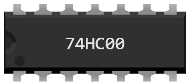

# 74xx00 — quad 2-input NAND gate

DIL-14 package for the breadboard: **four independent NAND gates**, each with its two inputs and its output. A NAND gate outputs 0 **only when both inputs are 1**: an AND followed by an inverter.

74 series: the “xx” in the part number is its **family** (HC, LS, HCT…). It changes neither the function nor the pinout, but it sets the **supply range** — hence which board the chip works on.

| Family | Supply |
|---|---|
| HC, AC, ACT | 2 to 6 V |
| C | 3 to 15 V |
| HCT, ALS, F | 4.5 to 5 V |
| S, LS | 4.75 to 5.25 V |

An Uno puts out 5 V: every family works. A **Pico only puts out 3.3 V**: only HC, AC, ACT and C work there — a 74LS00 on a Pico does nothing.

## Pins

| Pin | Name | Role |
|---|---|---|
| 1 | **A1** | input A of gate 1 |
| 2 | **B1** | input B of gate 1 |
| 3 | **Q1** | output of gate 1 |
| 4 | **A2** | input A of gate 2 |
| 5 | **B2** | input B of gate 2 |
| 6 | **Q2** | output of gate 2 |
| 7 | **GND** | ground — **black wire** |
| 8 | **Q3** | output of gate 3 |
| 9 | **B3** | input B of gate 3 |
| 10 | **A3** | input A of gate 3 |
| 11 | **Q4** | output of gate 4 |
| 12 | **A4** | input A of gate 4 |
| 13 | **B4** | input B of gate 4 |
| 14 | **VCC** | supply — **red wire** |

## Truth table

One gate; the others are identical.

| A | B | Q |
|---|---|---|
| 0 | 0 | 1 |
| 0 | 1 | 1 |
| 1 | 0 | 1 |
| 1 | 1 | 0 |

## Properties

| Property | Role | Default |
|---|---|---|
| `ref` | Part number — changing it changes the pinout, not the drawing | 74xx00 |
| `family` | 74 series family: it decides the supply range | HC |

## Simulation

- **Power is not optional**: without a red wire on VCC (pin 14) and a black wire on GND (pin 7), the chip outputs nothing at all.
- Outside the **of the chosen family (2 to 6 V for HC)** range Kablix reports “Incompatible supply voltage”. **Below it** the chip does nothing; **above it** the chip is DESTROYED — red cross, and it stays that way until the next run.
- A **floating input is not a 0**: the output stays undefined as long as that input matters (here a single input at 0 is enough to decide).
- An output drives the circuit just like a board pin: an LED **with its resistor**, a transistor base, or the input of another chip.

## Usage

- NAND is the **universal** gate: every other function can be built from it. Tie its two inputs together and it becomes an inverter.
- The 4 gates in the package are independent: one chip can serve 4 unrelated purposes.
- Wire the inputs to board outputs and the output to a board input: the program then reads a result computed by the chip, not by the microcontroller.
- Ready-made test: `CI-uno` and `CI-pico` in `testkablix/` — the twelve chips wired together, every gate checked.

---

*Kablix in-house component — drawing by Frank Sauret.*
