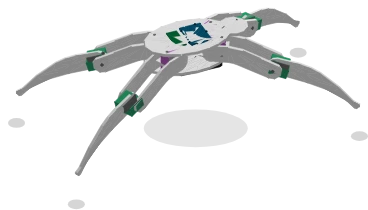

# Spider robot

A complete **quadruped robot**: a chassis and **4 legs with 2 joints each** (hip and knee), i.e. **8 servo motors**. All the electronics are **on board, inside the body** — a [PCA9685 PWM driver](pca9685.md), the microcontroller board and the battery: the 8 servos are wired internally, they never appear on the sheet.

On the sheet the spider therefore has only **4 wires**: the I²C bus. Every movement goes through it.

> **Placeholder drawing.** This component illustrates a simplified spider (top view) until the physical robot — a laser-cut PMMA spider, assembled by Frank in SketchUp — is visible. The drawing will likely be redone once the result is seen.

Palette category: **Actuators**.

## Pins

| Pin | Role |
|--------|------|
| **SCL** | I²C bus clock |
| **SDA** | I²C bus data |
| **V+** | Supply (+) for the control electronics |
| **GND** | Common ground |

The servos are powered by the **on-board battery**: `V+`/`GND` only feed the logic and provide the bus's common ground.

## Properties

| Property | Role | Default |
|-----------|------|--------|
| `address` | I²C address of the on-board PCA9685 (`0x40` … `0x47`) | `0x40` |
| `speed` | Time for a full 360° turn at full speed (s), 0 = instant movement | `2` |
| `boards` | Show the on-board electronics (Pico, PCA9685, battery) | unchecked |

90° = leg fully extended (both segments aligned), as on the [single leg](patte.md).

## PWM channels

The internal wiring is fixed: every joint has its own channel on the on-board PCA9685.

| Channel | Joint |
|-------|--------------|
| 0 / 1 | **Front-left** hip / knee |
| 2 / 3 | **Front-right** hip / knee |
| 4 / 5 | **Rear-left** hip / knee |
| 6 / 7 | **Rear-right** hip / knee |

The right-hand legs are **mirrored** with respect to the left-hand ones, as on the robot: the same knee angle bends both sides symmetrically.

## Usage

- Wire `SDA`/`SCL` to the board's I²C bus (A4/A5 on Uno, GP0/GP1 on Pico), plus `V+` and `GND`.
- Drive the channels exactly like those of a PCA9685 sitting on the sheet: set the prescaler to 50 Hz, then write the wanted pulse width (500 µs = 0°, 1500 µs = 90°, 2500 µs = 180°).
- To animate a single leg, just write its two channels: a channel that is never written leaves its joint still.
- Tick **Show on-board electronics** to reveal the boards inside the body (handy to explain the build, pointless for the simulation).

Example tests: `araignee-uno` and `araignee-pico` (`testkablix` folder).

---

*PLACEHOLDER drawing made by Claude for Kablix, pending Frank's final artwork.*
