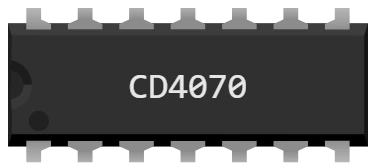

# CD4070 — quad 2-input XOR gate

DIL-14 package for the breadboard: **four independent XOR gates**, each with its two inputs and its output. An XOR gate outputs 1 **when its two inputs differ**.

CMOS 4000 series: it runs on **3 to 18 V**, the widest range of the lot — as happy with the 5 V of an Uno as with the 3.3 V of a Pico.

## Pins

| Pin | Name | Role |
|---|---|---|
| 1 | **A1** | input A of gate 1 |
| 2 | **B1** | input B of gate 1 |
| 3 | **Q1** | output of gate 1 |
| 4 | **Q2** | output of gate 2 |
| 5 | **A2** | input A of gate 2 |
| 6 | **B2** | input B of gate 2 |
| 7 | **GND** | ground — **black wire** |
| 8 | **A3** | input A of gate 3 |
| 9 | **B3** | input B of gate 3 |
| 10 | **Q3** | output of gate 3 |
| 11 | **Q4** | output of gate 4 |
| 12 | **A4** | input A of gate 4 |
| 13 | **B4** | input B of gate 4 |
| 14 | **VDD** | supply — **red wire** |

## Truth table

One gate; the others are identical.

| A | B | Q |
|---|---|---|
| 0 | 0 | 0 |
| 0 | 1 | 1 |
| 1 | 0 | 1 |
| 1 | 1 | 0 |

## Properties

| Property | Role | Default |
|---|---|---|
| `ref` | Part number — changing it changes the pinout, not the drawing | CD4070 |

## Simulation

- **Power is not optional**: without a red wire on VDD (pin 14) and a black wire on GND (pin 7), the chip outputs nothing at all.
- Outside the **3 to 18 V** range Kablix reports “Incompatible supply voltage”. **Below it** the chip does nothing; **above it** the chip is DESTROYED — red cross, and it stays that way until the next run.
- A **floating input is not a 0**: the output stays undefined as long as that input matters — and for this function it always matters.
- An output drives the circuit just like a board pin: an LED **with its resistor**, a transistor base, or the input of another chip.

## Usage

- XOR compares two bits (equal → 0, different → 1) and works as a half adder.
- The 4 gates in the package are independent: one chip can serve 4 unrelated purposes.
- Wire the inputs to board outputs and the output to a board input: the program then reads a result computed by the chip, not by the microcontroller.
- Ready-made test: `CI-uno` and `CI-pico` in `testkablix/` — the twelve chips wired together, every gate checked.

---

*Kablix in-house component — drawing by Frank Sauret.*
