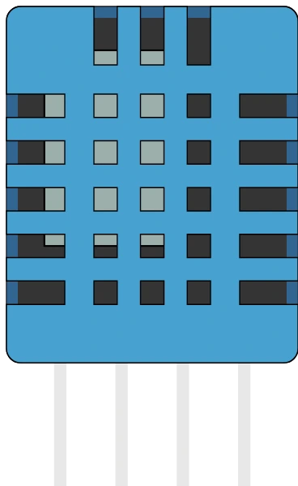

# DHT11 temperature/humidity sensor

Digital 1-wire temperature and humidity sensor, the little blue brother of the DHT22: less accurate and narrower in range, but same protocol and same wiring.

## Pins

| Pin | Role |
|--------|------|
| **VCC** | Supply (+) |
| **DATA** | Data (1-wire) |
| **NC** | Not connected |
| **GND** | Ground |

## Properties

| Property | Role | Default |
|-----------|------|--------|
| `temperature` | Temperature (°C) | 22 |
| `humidity` | Humidity (%) | 50 |
| `angle` | Orientation (0/90/180/270°) | 0 |

## Usage

- DATA to a digital pin (10 kΩ pull-up).
- DHT library: one reading every ~2 s. Polled faster, it returns its **cached value**, exactly like a real sensor.
- In simulation, two sliders set temperature and humidity **while** the program runs: the next reading returns the new value.
- DHT11 limits, enforced by the simulation: temperature 0 to +50 ℃, humidity 20 to 90 %RH, all as **whole numbers** (the DHT11 encodes neither tenths nor negatives). A setting outside the range is clamped to the sensor's limits. On real hardware, add ±2.0 ℃ and ±5.0 %RH of uncertainty.
- Need better accuracy, negative temperatures or extreme humidity? Use the [DHT22](dht22.md).

---

*Sheet adapted and translated from the [Wokwi documentation](https://docs.wokwi.com/parts/wokwi-dht22) — © Wokwi. `@wokwi/elements` components (MIT license). Case drawing: Frank Sauret.*
