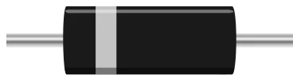

# Diode

Rectifier diode. Current only flows from the anode **A** to the cathode **K**, losing the threshold voltage on the way.

## Pins

| Pin | Role |
|--------|------|
| **A** | Anode (+) — opposite the band on the drawing |
| **K** | Cathode (−) — marked by the band |

## Properties

| Property | Role | Default |
|-----------|------|--------|
| `vf` | Threshold voltage (V) | 0.6 |
| `angle` | Orientation (0/90/180/270°) | 0 |

## Usage

- Polarized: it blocks in the K → A direction. An LED wired behind a reversed diode never lights up — the simplest test there is.
- In the forward direction, the downstream voltage drops by `vf` (0.6 V for a silicon diode, 0.3 V for a Schottky).
- Used to protect an input against reverse polarity, or as a flyback diode across a coil (relay, motor) to clamp its voltage spike.

---

*Kablix in-house component — drawing by Frank Sauret.*
