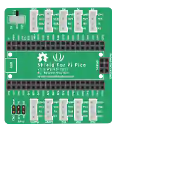

# Grove Shield (Pico)

**Grove Shield for Pi Pico v1.0** expansion board (Seeed Studio). The Pico (or Pico W) plugs into the two centre rows; the shield routes its I/O to 10 four-pin Grove ports, plus a 2×3 SPI header.

## Grove ports

| Port | Pins (top → bottom) | Pico GPIO |
|------|---------------------|-----------|
| **I2C0** | GND · VCC · SDA · SCL | GP8 / GP9 |
| **I2C1** | GND · VCC · SDA · SCL | GP6 / GP7 |
| **A0** | GND · 3V3 · NC · A0 | GP26 |
| **A1** | GND · 3V3 · A0 · A1 | GP26 / GP27 |
| **A2** | GND · 3V3 · A1 · A2 | GP27 / GP28 |
| **UART0** | GND · VCC · TX · RX | GP0 / GP1 |
| **UART1** | GND · VCC · TX · RX | GP4 / GP5 |
| **D16** | GND · VCC · D17 · D16 | GP17 / GP16 |
| **D18** | GND · VCC · D19 · D18 | GP19 / GP18 |
| **D20** | GND · VCC · D21 · D20 | GP21 / GP20 |
| **SPI** | SCK · TX · RX / GND · 3V3 · CS | GP2 / GP3 / GP4 / GP5 |

Digital and serial ports expose **two** signals: the second one is the GPIO the port is named after. Analog ports share a channel with their neighbour (A1 repeats A0, A2 repeats A1).

## Properties

| Property | Role | Default |
|-----------|------|--------|
| `pwr` | VCC rail of the Grove ports: `3v3` or `5v` (VBUS) | `3v3` |

## Usage

- Drop the shield, then **drag the Pico onto it**: it plugs into the socket and stays in front. Grove port wiring then follows the pinout above, with no wire to run back to the Pico.
- The `pwr` switch sets the VCC rail of the **I2C / UART / D16-D20** ports. Analog ports and the SPI header always stay at 3.3 V.
- At 5 V, VCC comes from VBUS (USB): signals themselves stay at 3.3 V — check that your Grove module accepts this.
- All grounds (socket, ports, SPI) sit on a single rail.
- **The GPIO is written on the pin bubble**: hovering `A1.A0` shows `A1.A0.GP26` — `GP26` is what your program must use. Power pins (VCC, GND, 3V3, NC) keep their plain name.

---

*Kablix component — pinout taken from the official Seeed schematic `Grove_shield_for_PI_PICO v1.0.sch`.*
