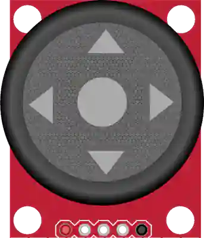

# Analog joystick

2-axis (X/Y) stick with built-in push button.

## Pins

| Pin | Role |
|--------|------|
| **VCC** | Power (+) |
| **VERT** | Vertical axis (analog) |
| **HORZ** | Horizontal axis (analog) |
| **SEL** | Button (press) |
| **GND** | Ground |

## Usage

- VERT and HORZ to two analog inputs, SEL in `INPUT_PULLUP`.
- At rest the axes read ~512 (center).

## In simulation

- **Stick**: drag it with the mouse for continuous values on both axes. It springs back to the center when released — unless you hold **Ctrl** (Cmd on Mac), which **locks** the position.
- **Arrows**: clicking one of the four arrows gives full deflection for as long as you hold it. The keyboard arrow keys do the same.
- **SEL button**: click the center of the stick. **Ctrl+click** (Cmd on Mac) **locks** the press — handy to test a held button without keeping your finger on the mouse; a plain click releases it.

---

*Sheet adapted and translated from the [Wokwi documentation](https://docs.wokwi.com/parts/wokwi-analog-joystick) — © Wokwi. `@wokwi/elements` components (MIT license).*
