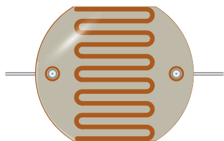

# LDR (photoresistor)



**Bare** photoresistor, two leads: its resistance drops as light increases. Not
to be confused with the [light sensor module](photoresistor.md), which is a full
board (VCC/GND, analog and digital outputs).

## Pins

| Pin | Role |
|--------|------|
| **1** | Terminal 1 |
| **2** | Terminal 2 (non-polarized) |

## Properties

| Property | Role | Default |
|-----------|------|--------|
| `r1lx` | Resistance at 1 lux (Ω) | 50,000 |
| `gamma` | Sensitivity coefficient (γ) | 0.7 |
| `lux` | Illuminance at rest (lux) | 500 |

## In simulation

An **illuminance slider** appears on the part while simulating: it sets the
incoming light, from darkness to full sun. Resistance follows the real LDR
characteristic:

```
R = r1lx x lux^(-gamma)
```

With the defaults: 50 kΩ at 1 lx, ~650 Ω at 500 lx (well-lit room). Resistance
is capped at 10 MΩ in the dark.

## Usage

- Wire the LDR as a **voltage divider** with a fixed resistor (10 kΩ typical),
  the midpoint going to an analog input.
- The voltage read by the ADC follows the actual divider of your circuit: no
  need for a ready-made module to get a credible reading.
- Non-polarized part: the two leads are equivalent.

---

*Kablix component — photometric model `R = r1lx x lux^(-gamma)`.*
