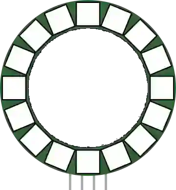

# NeoPixel ring

Ring of addressable RGB LEDs (WS2812).

## Pins

| Pin | Role |
|--------|------|
| **VCC** | Power (+) |
| **GND** | Ground |
| **DIN** | Data in |
| **DOUT** | Data out |

## Properties

| Property | Role | Default |
|-----------|------|--------|
| `pixels` | Number of LEDs | 16 |

## Usage

- DIN to a digital pin.
- Circular effects (rotation, gauge).
- During simulation an **off LED stays white** (like on the real board) and a **lit LED gets a halo** of its own colour, wider the brighter it is.

---

*Sheet adapted and translated from the [Wokwi documentation](https://docs.wokwi.com/parts/wokwi-led-ring) — © Wokwi. `@wokwi/elements` components (MIT license).*
