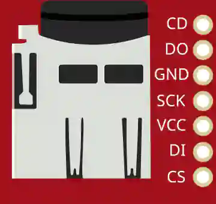

# microSD card (SPI)

microSD card reader over SPI: file storage.

## Pins

| Pin | Role |
|--------|------|
| **VCC / GND** | Power |
| **SCK** | SPI clock |
| **DI** | Data in (MOSI) |
| **DO** | Data out (MISO) |
| **CS** | Chip select |
| **CD** | Card detect |

## Usage

- SPI bus + CS. `SD` library.
- The simulated card ships **FAT16-formatted** (about 2 MB), just like a card off
  the shelf: `SD.begin()`, `SD.open()`, writing and reading files back all work
  with no preparation.
- Its contents live in memory: they are **lost when the simulation stops**, and the
  card starts out empty on the next run.

---

*Sheet adapted and translated from the [Wokwi documentation](https://docs.wokwi.com/parts/wokwi-microsd-card) — © Wokwi. `@wokwi/elements` components (MIT license).*
