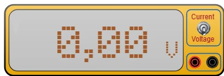

# Multimeter



Measuring instrument with two banana sockets. The **toggle switch** picks what it measures: lever **up** = **DC current** (ammeter), lever **down** = **DC voltage** (voltmeter). The display shows the reading with its unit, like a real instrument.

Palette category: **Measuring instruments**.

## Pins

| Terminal | Role |
|-------|------|
| **+** | **Red** banana socket — current input terminal, or the higher point of the measured voltage |
| **GND** | **Black** banana socket — return terminal |

The two sockets are 20 px apart (two grid steps). If the reading comes out **negative**, the two leads are swapped — as on a real instrument, that is not a wiring error, just a sign.

## Properties

| Property | Role | Default |
|-----------|------|--------|
| `mode` | Measurement: `voltage` (DC voltage) or `current` (DC current) | `voltage` |

The mode is picked in the panel **at any time**, or with a click on the toggle switch **during the simulation**. Changing mode clears the display: amperes read as volts mean nothing.

## Voltmeter: in parallel

The voltmeter measures a **difference in electrical height** between its two sockets. It is wired **across** whatever you want to measure, without cutting anything:

- across a resistor, an LED, a battery;
- between a board pin and the ground.

It draws nothing: the circuit behaves exactly as if the instrument were not there. You can therefore leave it wired in without ever falsifying anything.

## Ammeter: in series

The ammeter counts what **flows through** its sockets. You therefore have to **open the circuit** and insert it into the gap, inside the branch whose current you want:

```
+5 V ──── R 1 kΩ ──── [+ multimeter GND] ──── GND
```

Electrically, the ammeter is a **plain wire**: its two sockets are one single point of the circuit. That is what lets the current go through it without the measurement changing anything.

> **Careful — the classic trap.** An ammeter placed **across** a supply (the way you would place a voltmeter) **shorts it out**: a wire joins the plus straight to the minus. Kablix then frames the part in red and says so in the status bar. On a real instrument, that is the fuse blowing.

## What the display shows

- **Voltage**: `12.3 V`, `0.00 V`, `-5.00 V`.
- **Current**: in **milliamperes** below one ampere (`4.99 mA`), in amperes beyond (`1.25 A`).
- Four significant digits at most: below 10 two decimals, below 100 a single one, beyond none — like a three-and-a-half digit instrument.
- Sockets left **in the air** (nothing wired): the display stays at zero.

## Usage

- To **read a voltage**, leave the circuit as it is and put the two sockets on the points to compare.
- To **read a current**, cut the wire of the branch you are after and put the multimeter in place of the piece you removed.
- The reading refreshes on every frame of the simulation: it follows an LED lighting up, a motor starting, a potentiometer being turned.
- Outside the simulation the display is off and the switch does not toggle — a click then serves to select and move the instrument.

---

*Instrument drawing made by Frank for Kablix.*
