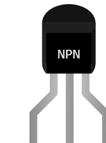

# Transistor NPN (generic)

Prototype of an **NPN** bipolar transistor: package, marking, gain and pinout are all set in the properties. Use it for any model that has no dedicated sheet yet (BC547, 2N3904, S8050…).

## Pins

The legs are named **1**, **2** and **3**, in drawing order — never E/B/C. Changing the electrode assignment therefore renames no pin, and **no wire is ever orphaned**.

| Pin | Role |
|--------|------|
| **1** | First leg (emitter by default) |
| **2** | Second leg (base by default) |
| **3** | Third leg (collector by default) |

## Properties

| Property | Role | Default |
|-----------|------|--------|
| `pkg` | Component package | TO-92 |
| `e` | Leg carrying the emitter (1, 2 or 3) | 1 |
| `b` | Leg carrying the base (1, 2 or 3) | 2 |
| `c` | Leg carrying the collector (1, 2 or 3) | 3 |
| `gain` | Current gain β (1 decimal) | 100 |
| `text` | Package marking (one line per typed line) | NPN |
| `vcemax` | Max Vce (V) | 40 |
| `icmax` | Max Ic (A) | 0.6 |

A leg carries **one** electrode only: assigning the emitter to the leg already taken by the collector **swaps** the two.

## Simulation

- Conducts when its **base is high and its emitter low**.
- The current it passes is capped at **Gain × Ib**: aim for saturation, otherwise the downstream circuit does not work.
- The real pinout depends on the model: a BC547 seen from the front is C-B-E (1-2-3), a TO-92 2N2222 is E-B-C. That is exactly what the `e`, `b`, `c` properties are for.

## Usage

- Write the part number on the package with `text`: one line per typed line ("BC" then "547" prints two lines on the component).
- To import your own drawing, use the **part creator** (simulation model "Bipolar transistor").

---

*Kablix in-house component — drawing by Frank Sauret.*
