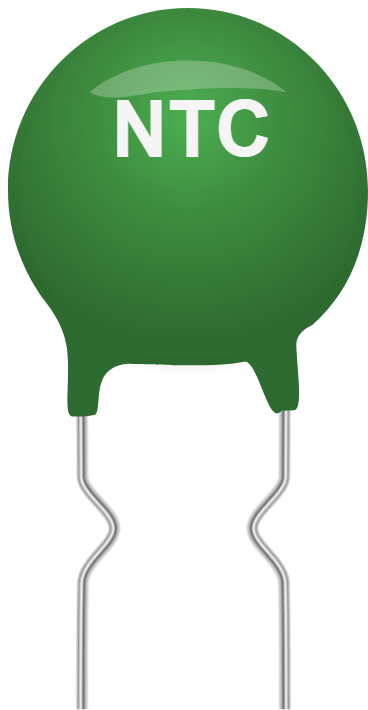

# NTC thermistor



**Negative** temperature coefficient thermistor: its resistance **drops** as
temperature rises. Bare two-lead part, to be wired as a voltage divider. Positive
coefficient variant: the [PTC](ptc.md).

## Pins

| Pin | Role |
|--------|------|
| **1** | Terminal 1 |
| **2** | Terminal 2 (non-polarized) |

## Properties

| Property | Role | Default |
|-----------|------|--------|
| `r25` | Resistance at 25 °C (Ω) | 10,000 |
| `beta` | Beta coefficient (K) | 3950 |
| `tmin` | Slider minimum temperature (°C) | -55 |
| `tmax` | Slider maximum temperature (°C) | 125 |

## In simulation

A **temperature slider** appears on the part while simulating, bounded by `tmin`
and `tmax`. Resistance follows the Beta law:

```
R = r25 x exp( beta x (1/(T+273.15) - 1/298.15) )
```

With the defaults: 10 kΩ at 25 °C, ~34 kΩ at 0 °C, ~3.6 kΩ at 50 °C.

## Usage

- Wire the NTC as a **voltage divider** with a fixed resistor of the same order
  as `r25` (10 kΩ for a 10 kΩ NTC), the midpoint going to an analog input.
- `beta` comes from the thermistor datasheet (3380, 3950, 4050…).
- Non-polarized part: the two leads are equivalent.

---

*Kablix component — Beta model `R = r25 x exp(beta x (1/T - 1/T25))`.*
