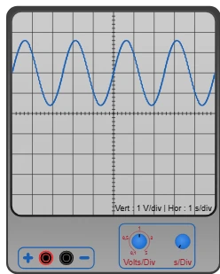

# Oscilloscope



Measuring instrument with two banana sockets, like the [multimeter](multimetre.md) — but instead of a number it **draws the voltage over time**. The screen carries a **10 by 10** grid, with both axes through the middle. Two knobs set the size of one square: one for the height (volts), one for the width (time).

Palette category: **Measuring instruments**.

## Pins

| Terminal | Role |
|-------|------|
| **+** | **Red** banana socket — the point whose voltage you are watching |
| **GND** | **Black** banana socket — the reference point |

The two sockets are 20 px apart (two grid steps). The oscilloscope is wired **in parallel**, across whatever you want to see, exactly like a voltmeter: across a resistor, an LED, or between a board pin and the ground. It draws nothing, the circuit behaves as if it were not there.

If the trace goes down instead of up, the two leads are swapped — that is not a wiring error, just a sign.

## Properties

| Property | Role | Default |
|-----------|------|--------|
| `voltsdiv` | Height of one square, in volts: `0.1`, `0.5`, `1`, `2` or `5` | `1` |
| `sdiv` | Width of one square, in seconds — **any number** | `1` |
| `trigger` | **Trigger** voltage, in volts. **Empty** = set on its own | *(empty)* |
| `triggeredge` | Which edge triggers: `rising` or `falling` | `rising` |

Both are set in the panel at any time, or **with the mouse on the knobs during the simulation**.

## The two knobs

Each knob turns one notch per **click**: on its **right half** to turn right, on its **left half** to turn left. The mouse **wheel** works too.

- **Volts/Div** (left knob): five notches drawn, `0.1 · 0.5 · 1 · 2 · 5` volts per square, with a **stop** at both ends. The smaller the number, the taller the trace. The screen is 5 squares above the axis and 5 below: at 1 V/div, it shows from −5 V to +5 V.
- **s/Div** (right knob): **no stop**, it turns as long as you want. To the **right** the trace **stretches** (fewer seconds per square, you see the detail); to the **left** it **shrinks** (you see a longer stretch of time). A full turn is a factor of **10**, that is eight notches. No `1-2-5` list: the in-between values exist (`1.33 s/div`, `562 ms/div`…).

The caption **under the screen** recalls both ranges and the trigger voltage, in whichever unit speaks:

```
Vert: 2 V/div
Hor: 500 ms/div
Trig: 0.8 V
```

## Triggering

Without it, a repeating trace **slides endlessly**: every frame starts wherever chance left it, and a perfectly steady square wave looks like it is running across the screen. Triggering fixes that the way you line a film back up on the same frame: the instrument looks back in time for the last place where the signal **crosses a given voltage in a given direction**, and it puts **that point** at the left edge of the screen. The trace is then redrawn always in the same place, standing still.

- **The cursor** — the small blue triangle stuck to the **left** edge of the screen — gives the **voltage**. During the simulation you **grab it with the mouse** and move it up or down; the caption follows (`Trig: …`). As long as you do not touch it, it sets itself **halfway up the signal**, which suits just about everything (square wave, sine, sawtooth).
- **The small knob** at the bottom right of the drawing picks the **direction**: its blue half **up** = **rising** edge (the signal climbs as it crosses), **down** = **falling** edge. One click swaps them.

If the signal never crosses that voltage — a steady DC voltage, or a cursor pushed too high — there is nothing to line up on: the trace **runs again** as before. That is the sign that the cursor has to come back down into the signal.

## What the screen shows

- With no possible trigger, the trace **scrolls to the left**: the present is at the **right** edge, the past leaves through the left. The visible width is **10 squares**, so ten times the horizontal range.
- The time shown is the one of the **program**, not the one of the clock on the wall. Slowed down, the trace is drawn more slowly but keeps the right scale.
- A signal that is too tall is **clipped at the edge** of the screen, as on a real instrument: lower the vertical range (a bigger number) to fit it in.
- Sockets left **in the air** (nothing wired): the trace stops.
- The screen is **cleared when the simulation starts**: every run begins on a clean trace.
- Outside the simulation the screen is empty and the knobs do not turn — a click then serves to select and move the instrument.

> **What it cannot do.** The instrument takes **one point per frame**, that is about 60 per second. It shows very well what is **slow**: an LED lighting up, a capacitor charging, a potentiometer being turned, a signal blinking at a few hertz. It does **not** show the shape of a fast signal (a 500 Hz PWM, a serial frame): it only catches a few random points of it.

## Usage

- Put the two sockets on the points to compare, start the simulation, then set the **Volts/Div** first so the trace fits in the screen, and the **s/Div** next to see what interests you.
- A trace running across the screen while the signal repeats: it is the **trigger** that needs setting — bring the cursor down into the middle of the signal.
- To watch a capacitor charge, use 1 V/div and a few hundred milliseconds per square.
- To watch a slowly moving voltage (a sensor, a potentiometer), go up to several seconds per square: the screen becomes a chart recorder.

---

*Instrument drawing made by Frank for Kablix.*
